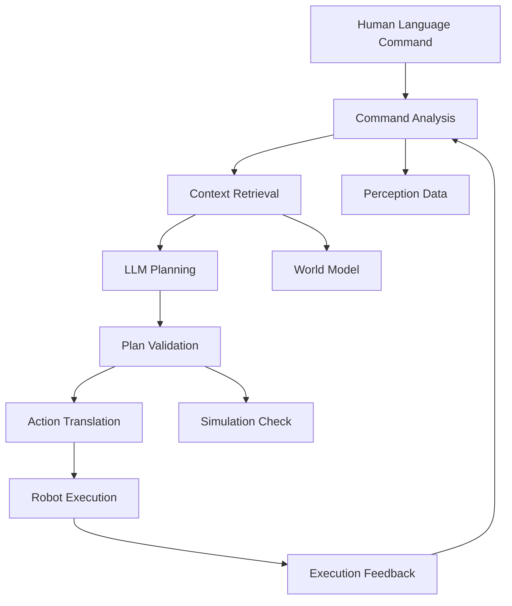

# LLM Cognitive Planning for Robots

## Introduction to Cognitive Planning in Physical AI

Cognitive planning using Large Language Models (LLMs) represents a paradigm shift in how humanoid robots understand and execute complex tasks. Unlike traditional approaches that rely on pre-programmed state machines or behavior trees, cognitive planning uses the rich world knowledge and reasoning capabilities embedded in LLMs to interpret natural language instructions and generate appropriate action sequences for physical systems.

### The Role of Cognitive Planning in Physical AI

In Physical AI systems, cognitive planning bridges the gap between high-level human instructions and low-level robot control:

```
Human Instruction ("Go to the kitchen and bring me a red apple")
         ↓
[Language Understanding] → "navigation" + "object_search" + "manipulation" + "red_apple" + "bring_back"
         ↓
[Cognitive Planner] → "Plan: 1) Navigate to kitchen 2) Search for red apple 3) Grasp apple 4) Return to human"
         ↓
[Action Translator] → ROS navigation goal + object detection task + grasp action + navigation goal
         ↓
[Robot Execution] → Physical robot carries out the plan
```

This approach offers several advantages over traditional planning:
- **Natural Language Interface**: Humans can express complex tasks in everyday language
- **Generalization**: LLMs contain knowledge about common procedures and object affordances
- **Flexibility**: Plans can adapt to different contexts and environments
- **Rich Reasoning**: LLMs can infer implicit steps and considerations

### Challenges and Considerations

However, cognitive planning with LLMs for robotics also introduces challenges:
- **Grounding**: Connecting abstract language concepts to physical reality
- **Temporal Consistency**: Ensuring multi-step plans remain coherent
- **Embodiment**: Accounting for robot-specific capabilities and limitations
- **Safety**: Ensuring plans are safe for execution in physical environments
- **Real-time Performance**: Balancing planning quality with execution timing

## LLM Selection and Architecture

### Choosing the Right Model Architecture

Different LLM architectures have varying suitability for cognitive planning:

#### Decoder-Only Models
- **Examples**: GPT-3, GPT-4, Llama, Mistral
- **Advantages**: Generative capabilities, good for step-by-step planning
- **Disadvantages**: May generate inconsistent plans

#### Encoder-Decoder Models
- **Examples**: T5, FLAN-T5
- **Advantages**: Better for mapping between different formats
- **Disadvantages**: Less generative flexibility

#### Specialized Vision-Language Models
- **Examples**: BLIP-2, Flamingo, PaLM-E
- **Advantages**: Better integration with robotic perception
- **Disadvantages**: More computationally intensive

For humanoid robotics cognitive planning, decoder-only models are typically preferred due to their ability to generate detailed action sequences.

### Model Size vs. Performance Trade-offs

When selecting an LLM for cognitive planning:

#### Large Models (70B+ parameters)
- **Pros**: More world knowledge, better reasoning, fewer hallucinations
- **Cons**: High computational requirements, slower inference
- **Best For**: Complex multi-step planning with rich context

#### Medium Models (13B-30B parameters)
- **Pros**: Good balance of capability and efficiency
- **Cons**: May miss subtle reasoning steps
- **Best For**: Most humanoid robotics applications

#### Small Models (3B-7B parameters)
- **Pros**: Efficient, fast, suitable for edge deployment
- **Cons**: Limited world knowledge and reasoning capability
- **Best For**: Simple, well-defined tasks

## Implementing Cognitive Planning

### Basic Cognitive Planning Pipeline

A typical cognitive planning pipeline consists of several stages:



### 1. Command Analysis

The first step is to parse and understand the human command:

```python
import re
import json
from dataclasses import dataclass
from typing import List, Optional

@dataclass
class TaskSpecification:
    """Parsed representation of a human command"""
    primary_action: str
    target_objects: List[str]
    target_locations: List[str]
    constraints: List[str]  # Speed, care, etc.
    tools_needed: List[str]
    success_criteria: List[str]

class CommandAnalyzer:
    def __init__(self):
        self.action_keywords = {
            'navigation': ['go', 'move', 'navigate', 'walk', 'drive', 'head to', 'come to'],
            'manipulation': ['pick', 'grasp', 'take', 'grab', 'lift', 'place', 'put', 'move'],
            'interaction': ['greet', 'wave', 'follow', 'escort', 'guide'],
            'search': ['find', 'locate', 'search for', 'look for', 'get']
        }
    
    def analyze_command(self, command_text: str) -> TaskSpecification:
        """Extract task components from natural language command"""
        text_lower = command_text.lower()
        
        # Identify primary action
        primary_action = self.identify_primary_action(text_lower)
        
        # Extract target objects
        target_objects = self.extract_objects(text_lower)
        
        # Extract target locations
        target_locations = self.extract_locations(text_lower)
        
        # Extract constraints
        constraints = self.extract_constraints(text_lower)
        
        return TaskSpecification(
            primary_action=primary_action,
            target_objects=target_objects,
            target_locations=target_locations,
            constraints=constraints,
            tools_needed=[],
            success_criteria=[]
        )
    
    def identify_primary_action(self, text: str) -> str:
        """Identify the main action type from the command"""
        for action_type, keywords in self.action_keywords.items():
            for keyword in keywords:
                if keyword in text:
                    return action_type
        return "unknown"
    
    def extract_objects(self, text: str) -> List[str]:
        """Extract potential target objects from text"""
        # Simple pattern matching - in practice, use more sophisticated NLP
        object_patterns = [
            r'(\w+)\s+(?:ball|cube|block|cup|bottle|book|box|object)',
            r'(?:the|a|an)\s+(\w+)\s+(?:apple|banana|orange|fruit)',  # Food items
            r'(?:the|a|an)\s+(\w+)\s+(?:chair|table|couch|desk)',  # Furniture
            r'(?:red|blue|green|yellow|big|small|large|tiny)\s+(\w+)'  # Colored/size-adjective objects
        ]
        
        objects = []
        for pattern in object_patterns:
            matches = re.findall(pattern, text)
            objects.extend(matches)
        
        return list(set(objects))  # Remove duplicates
    
    def extract_locations(self, text: str) -> List[str]:
        """Extract potential target locations from text"""
        location_patterns = [
            r'in the\s+(\w+(?:\s+\w+)*)',  # "in the kitchen", "in the living room"
            r'to the\s+(\w+(?:\s+\w+)*)',  # "go to the kitchen"
            r'(?:at|on|by|near)\s+the\s+(\w+(?:\s+\w+)*)',  # "at the table"
            r'(?:kitchen|living room|bedroom|office|bathroom|hallway|entrance)'  # Explicit room names
        ]
        
        locations = []
        for pattern in location_patterns:
            matches = re.findall(pattern, text, re.IGNORECASE)
            locations.extend([loc.strip() for loc in matches])
        
        return list(set(locations))
    
    def extract_constraints(self, text: str) -> List[str]:
        """Extract constraints like speed, care requirements"""
        constraint_keywords = [
            'slowly', 'quickly', 'carefully', 'gently', 'fast', 'careful', 
            'urgent', 'immediately', 'quietly', 'stealthily'
        ]
        
        constraints = []
        for keyword in constraint_keywords:
            if keyword in text:
                constraints.append(keyword)
        
        return constraints

# Example usage
analyzer = CommandAnalyzer()
command = "Please go to the kitchen quickly and carefully bring me the red apple from the counter"
spec = analyzer.analyze_command(command)

print(f"Action: {spec.primary_action}")
print(f"Objects: {spec.target_objects}")
print(f"Locations: {spec.target_locations}")
print(f"Constraints: {spec.constraints}")
```

### 2. Context Integration

Integrating environmental and robot state context is crucial for effective planning:

```python
from dataclasses import dataclass
from typing import Dict, Any
import json

@dataclass
class RobotCapability:
    """Definition of robot capabilities and limitations"""
    mobility_type: str  # "wheeled", "bipedal", "quadrapedal", etc.
    max_speed: float  # m/s
    navigation_modes: List[str]  # "teleop", "autonomous", "guided"
    manipulation_capability: str  # "none", "simple", "complex"
    joint_limits: Dict[str, Dict[str, float]]  # {joint_name: {min: value, max: value}}
    sensors: List[str]  # Available sensor types
    payload_capacity: float  # kg

@dataclass
class WorldState:
    """Current state of the environment and robot"""
    robot_pose: Dict[str, float]  # {x, y, z, qx, qy, qz, qw}
    detected_objects: List[Dict[str, Any]]  # List of detected objects with properties
    navigable_areas: List[str]  # Names of accessible areas
    robot_battery_level: float  # 0.0 to 1.0
    robot_capabilities: RobotCapability

@dataclass
class EnvironmentalContext:
    """Context describing the environment"""
    layout: str  # Building layout description
    current_scene: str  # Current location description
    time_of_day: str  # "morning", "afternoon", "evening", "night"
    lighting_conditions: str
    noise_level: str  # "quiet", "moderate", "noisy"
    people_present: int
    accessibility_constraints: List[str]

class ContextIntegrator:
    def __init__(self, world_model, robot_model):
        self.world_model = world_model
        self.robot_model = robot_model
    
    def get_planning_context(self, task_spec: TaskSpecification) -> Dict[str, Any]:
        """Combine world state, robot capabilities and environmental context"""
        world_state = self.world_model.get_current_state(task_spec.target_locations)
        robot_caps = self.robot_model.get_capabilities()
        env_context = self.world_model.get_environmental_context()
        
        # Create a rich context for the LLM
        context = {
            "task_requirements": {
                "action": task_spec.primary_action,
                "targets": {
                    "objects": task_spec.target_objects,
                    "locations": task_spec.target_locations
                },
                "constraints": task_spec.constraints
            },
            "robot_state": {
                "current_pose": world_state.robot_pose,
                "battery_level": world_state.robot_battery_level,
                "capabilities": {
                    "mobility_type": robot_caps.mobility_type,
                    "max_speed": robot_caps.max_speed,
                    "manipulation_capability": robot_caps.manipulation_capability,
                    "payload_capacity": robot_caps.payload_capacity,
                    "available_sensors": robot_caps.sensors
                }
            },
            "environment": {
                "layout": env_context.layout,
                "current_area": env_context.current_scene,
                "accessible_areas": world_state.navigable_areas,
                "detected_objects": self._filter_relevant_objects(
                    world_state.detected_objects, 
                    task_spec.target_objects
                ),
                "time_of_day": env_context.time_of_day,
                "lighting": env_context.lighting_conditions,
                "people_count": env_context.people_present,
                "accessibility_constraints": env_context.accessibility_constraints
            },
            "safety_constraints": [
                "Avoid obstacles",
                "Maintain safe distance from people",
                "Operate within joint limits",
                "Consider battery level for navigation planning"
            ]
        }
        
        return context
    
    def _filter_relevant_objects(self, all_objects: List[Dict], target_types: List[str]) -> List[Dict]:
        """Filter detected objects to those relevant to the task"""
        if not target_types:
            return all_objects
        
        relevant_objects = []
        for obj in all_objects:
            for target_type in target_types:
                if target_type.lower() in obj.get('type', '').lower() or \
                   target_type.lower() in obj.get('name', '').lower() or \
                   target_type.lower() in obj.get('color', '').lower():
                    relevant_objects.append(obj)
                    break  # Don't duplicate if matches multiple targets
        
        return relevant_objects
```

### 3. LLM-Based Planning

Now, let's implement the cognitive planner using an LLM:

```python
import openai
import json
import time
from typing import Dict, List, Any
from dataclasses import dataclass

@dataclass
class CognitivePlanStep:
    """A single step in a cognitive plan"""
    step_number: int
    action: str
    parameters: Dict[str, Any]
    expected_outcome: str
    alternatives: List[str]  # Alternative approaches if primary fails
    safety_checks: List[str]  # Safety checks before execution

@dataclass
class CognitivePlan:
    """Complete cognitive plan for task execution"""
    task_description: str
    steps: List[CognitivePlanStep]
    estimated_duration: float  # seconds
    confidence_score: float  # 0.0 to 1.0
    potential_issues: List[str]

class LLMBasedCognitivePlanner:
    def __init__(self, api_key: str = None, model_name: str = "gpt-3.5-turbo"):
        self.model_name = model_name
        if api_key:
            openai.api_key = api_key
        
        # Define system prompt for planning
        self.system_prompt = """
You are an expert cognitive planner for humanoid robots operating in Physical AI contexts. 
Your role is to generate detailed, safe, and executable plans based on natural language 
instructions combined with environmental and robot state context.

When generating plans:

1. Consider the robot's physical capabilities and limitations
2. Account for environmental constraints and safety requirements
3. Break complex tasks into executable steps
4. Include appropriate perception and verification steps
5. Consider potential failure modes and recovery strategies
6. Ensure plans are temporally and spatially coherent

Respond ONLY with valid JSON following the specified format.
"""
    
    def generate_plan(self, task_spec: TaskSpecification, context: Dict[str, Any]) -> CognitivePlan:
        """Generate a cognitive plan using LLM"""
        
        # Craft a detailed prompt for the LLM
        prompt = self._construct_planning_prompt(task_spec, context)
        
        # Call the LLM to generate the plan
        response = self._call_llm(prompt)
        
        # Parse and validate the response
        plan_data = self._parse_plan_response(response)
        
        # Convert to CognitivePlan object
        plan = self._create_plan_object(plan_data)
        
        return plan
    
    def _construct_planning_prompt(self, task_spec: TaskSpecification, context: Dict[str, Any]) -> str:
        """Construct a detailed prompt for the LLM"""
        prompt = f"""
Task: {task_spec.primary_action} to {' and '.join(task_spec.target_locations) if task_spec.target_locations else 'current location'} 
         to interact with {' and '.join(task_spec.target_objects) if task_spec.target_objects else 'environment'}.
Constraints: {', '.join(task_spec.constraints) if task_spec.constraints else 'None'}

Robot Context:
- Mobility: {context['robot_state']['capabilities']['mobility_type']}
- Max Speed: {context['robot_state']['capabilities']['max_speed']} m/s
- Manipulation: {context['robot_state']['capabilities']['manipulation_capability']}
- Payload Capacity: {context['robot_state']['capabilities']['payload_capacity']} kg
- Current Position: ({context['robot_state']['current_pose'].get('x', 0)}, {context['robot_state']['current_pose'].get('y', 0)})
- Battery Level: {context['robot_state']['battery_level']:.1%}

Environment Context:
- Layout: {context['environment']['layout']}
- Current Area: {context['environment']['current_area']}
- Accessible Areas: {', '.join(context['environment']['accessible_areas'])}
- Detected Objects: {len(context['environment']['detected_objects'])} nearby
- Time: {context['environment']['time_of_day']}, Lighting: {context['environment']['lighting']}
- People Present: {context['environment']['people_count']}

Generate a detailed cognitive plan with sequential steps to accomplish the task, considering:
- The robot must physically navigate to locations
- Objects may need to be perceived before interaction
- Safety is paramount - avoid collisions and ensure stable movement
- Consider battery life for longer navigation tasks
- Verify task completion before reporting success

Return ONLY a JSON object with this structure:
{{
  "task_description": "Brief description of the task",
  "steps": [
    {{
      "step_number": integer,
      "action": "action_name",
      "parameters": {{"param_name": "value"}},
      "expected_outcome": "what should happen",
      "alternatives": ["alternative_1", "alternative_2"],
      "safety_checks": ["check1", "check2"]
    }}
  ],
  "estimated_duration": float_seconds,
  "confidence_score": float_0_to_1,
  "potential_issues": ["issue1", "issue2"]
}}

Example of good plan for "go to kitchen and bring red apple":
{{
  "task_description": "Navigate to kitchen and retrieve red apple",
  "steps": [
    {{
      "step_number": 1,
      "action": "navigate",
      "parameters": {{"target_location": "kitchen"}},
      "expected_outcome": "robot reaches kitchen area with clear view of counters",
      "alternatives": ["navigate to alternative kitchen entrance", "ask for directions"],
      "safety_checks": ["check for obstacles", "maintain safe speed"]
    }},
    {{
      "step_number": 2,
      "action": "perceive_environment",
      "parameters": {{"focus": "counters", "object_types": ["apple", "fruit"]}},
      "expected_outcome": "identify red apples on counters",
      "alternatives": ["expand search area", "ask human for help"],
      "safety_checks": ["keep safe distance from objects", "stable stance during perception"]
    }}
  ],
  "estimated_duration": 180.0,
  "confidence_score": 0.85,
  "potential_issues": ["no red apples available", "kitchen is cluttered", "navigation path blocked"]
}}
"""
        return prompt
    
    def _call_llm(self, prompt: str) -> str:
        """Call the LLM with the constructed prompt"""
        try:
            response = openai.ChatCompletion.create(
                model=self.model_name,
                messages=[
                    {"role": "system", "content": self.system_prompt},
                    {"role": "user", "content": prompt}
                ],
                temperature=0.1,  # Low temperature for consistency
                max_tokens=1500,
                response_format={"type": "json_object"}  # Request JSON response
            )
            
            return response.choices[0].message.content
        except Exception as e:
            print(f"Error calling LLM: {e}")
            # Return a simple fallback plan
            return self._generate_fallback_plan()
    
    def _parse_plan_response(self, response: str) -> Dict[str, Any]:
        """Parse and validate the LLM response"""
        try:
            # Extract JSON from response if needed (in case LLM adds extra text)
            json_start = response.find('{')
            json_end = response.rfind('}') + 1
            
            if json_start != -1 and json_end != 0:
                json_str = response[json_start:json_end]
                plan_data = json.loads(json_str)
                
                # Validate required fields
                required_fields = ["task_description", "steps", "estimated_duration", "confidence_score"]
                for field in required_fields:
                    if field not in plan_data:
                        raise ValueError(f"Missing required field: {field}")
                
                return plan_data
            else:
                raise ValueError("No valid JSON found in response")
        except json.JSONDecodeError:
            print("Invalid JSON response from LLM")
            return self._generate_fallback_plan()
        except Exception as e:
            print(f"Error parsing LLM response: {e}")
            return self._generate_fallback_plan()
    
    def _generate_fallback_plan(self) -> Dict[str, Any]:
        """Generate a simple fallback plan if LLM fails"""
        return {
            "task_description": "Simple navigation task",
            "steps": [
                {
                    "step_number": 1,
                    "action": "request_human_assistance",
                    "parameters": {"reason": "Could not generate plan for task"},
                    "expected_outcome": "Human provides guidance or alternative task",
                    "alternatives": [],
                    "safety_checks": ["stop robot movement"]
                }
            ],
            "estimated_duration": 10.0,
            "confidence_score": 0.1,
            "potential_issues": ["LLM unavailable", "Task too complex for current system"]
        }
    
    def _create_plan_object(self, plan_data: Dict[str, Any]) -> CognitivePlan:
        """Convert plan data to CognitivePlan object"""
        steps = []
        for step_data in plan_data.get("steps", []):
            step = CognitivePlanStep(
                step_number=step_data.get("step_number", 0),
                action=step_data.get("action", "unknown"),
                parameters=step_data.get("parameters", {}),
                expected_outcome=step_data.get("expected_outcome", ""),
                alternatives=step_data.get("alternatives", []),
                safety_checks=step_data.get("safety_checks", [])
            )
            steps.append(step)
        
        return CognitivePlan(
            task_description=plan_data.get("task_description", "Unknown task"),
            steps=steps,
            estimated_duration=plan_data.get("estimated_duration", 0.0),
            confidence_score=plan_data.get("confidence_score", 0.5),
            potential_issues=plan_data.get("potential_issues", [])
        )

# Example of using the planner
def example_usage():
    # Mock data for demonstration
    analyzer = CommandAnalyzer()
    command = "Go to the kitchen and bring me the red apple from the counter"
    task_spec = analyzer.analyze_command(command)
    
    # In a real system, these would come from actual robot/world interfaces
    world_state = WorldState(
        robot_pose={"x": 0.0, "y": 0.0, "z": 0.0, "qx": 0, "qy": 0, "qz": 0, "qw": 1},
        detected_objects=[],
        navigable_areas=["kitchen", "living_room", "bedroom"],
        robot_battery_level=0.8,
        robot_capabilities=RobotCapability(
            mobility_type="bipedal", 
            max_speed=0.5,
            navigation_modes=["autonomous"],
            manipulation_capability="simple",
            joint_limits={},
            sensors=["camera", "lidar", "imu"],
            payload_capacity=2.0
        )
    )
    
    # Create a mock context integrator and planner
    context_integrator = ContextIntegrator(None, None)
    planner = LLMBasedCognitivePlanner(model_name="gpt-3.5-turbo")
    
    # Generate planning context (in reality, this would be richer with real data)
    context = {
        "task_requirements": {
            "action": task_spec.primary_action,
            "targets": {
                "objects": task_spec.target_objects,
                "locations": task_spec.target_locations
            },
            "constraints": task_spec.constraints
        },
        "robot_state": {
            "current_pose": world_state.robot_pose,
            "battery_level": world_state.robot_battery_level,
            "capabilities": {
                "mobility_type": world_state.robot_capabilities.mobility_type,
                "max_speed": world_state.robot_capabilities.max_speed,
                "manipulation_capability": world_state.robot_capabilities.manipulation_capability,
                "payload_capacity": world_state.robot_capabilities.payload_capacity,
                "available_sensors": world_state.robot_capabilities.sensors
            }
        },
        "environment": {
            "layout": "apartment with kitchen, living room, bedroom",
            "current_area": "living_room",
            "accessible_areas": world_state.navigable_areas,
            "detected_objects": [],
            "time_of_day": "afternoon",
            "lighting": "bright",
            "people_count": 1,
            "accessibility_constraints": []
        },
        "safety_constraints": [
            "Avoid obstacles",
            "Maintain safe distance from people",
            "Operate within joint limits",
            "Consider battery level for navigation planning"
        ]
    }
    
    # Generate the plan
    plan = planner.generate_plan(task_spec, context)
    
    print(f"Generated plan for: {plan.task_description}")
    print(f"Confidence: {plan.confidence_score:.2f}")
    print(f"Estimated duration: {plan.estimated_duration}s")
    print("\nSteps:")
    for step in plan.steps:
        print(f"  {step.step_number}. {step.action}")
        print(f"     Parameters: {step.parameters}")
        print(f"     Expected: {step.expected_outcome}")
        if step.alternatives:
            print(f"     Alternatives: {', '.join(step.alternatives)}")
        if step.safety_checks:
            print(f"     Safety: {', '.join(step.safety_checks)}")
```

## Advanced Planning Concepts

### Multi-Modal Cognitive Planning

For Physical AI applications, cognitive planning must integrate multiple sensory modalities:

```python
class MultiModalCognitivePlanner(LLMBasedCognitivePlanner):
    def __init__(self, *args, **kwargs):
        super().__init__(*args, **kwargs)
        self.vision_system = None  # Initialize with vision processing system
        self.audio_system = None   # Initialize with audio processing system
        self.tactile_system = None # Initialize with tactile processing system
        
    def generate_multimodal_plan(self, task_spec: TaskSpecification, 
                                 context: Dict[str, Any]) -> CognitivePlan:
        """Generate plan incorporating multi-modal input"""
        
        # Enhance context with multi-modal information
        enhanced_context = self._enhance_context_with_modalities(context)
        
        # Generate plan with enhanced context
        return self.generate_plan(task_spec, enhanced_context)
    
    def _enhance_context_with_modalities(self, context: Dict[str, Any]) -> Dict[str, Any]:
        """Add multi-modal information to planning context"""
        enhanced = context.copy()
        
        # Add high-level vision information
        if self.vision_system:
            visual_context = self._get_visual_context()
            enhanced["modalities"] = enhanced.get("modalities", {})
            enhanced["modalities"]["vision"] = visual_context
        
        # Add audio context (for spatial audio, language understanding)
        if self.audio_system:
            audio_context = self._get_audio_context()
            enhanced["modalities"] = enhanced.get("modalities", {})
            enhanced["modalities"]["audio"] = audio_context
        
        return enhanced
    
    def _get_visual_context(self) -> Dict[str, Any]:
        """Get relevant visual information for planning"""
        # In practice, this would query the vision system
        # for object locations, spatial layout, etc.
        return {
            "object_affordances": {
                "red_apple": ["graspable", "movable", "edible"],
                "wooden_table": ["placeable_on", "obstacle", "support_surface"]
            },
            "spatial_layout": {
                "kitchen_counter": {"x": 2.5, "y": 1.2, "z": 0.85},
                "refrigerator": {"x": 3.0, "y": 1.0, "z": 1.0}
            },
            "navigation_landmarks": ["doorway", "kitchen_counter", "refrigerator"]
        }
    
    def _get_audio_context(self) -> Dict[str, Any]:
        """Get relevant audio information for planning"""
        # In practice, this would include spatial audio, 
        # speaker localization, etc.
        return {
            "sound_sources": [
                {"direction": 45, "type": "human_speech", "confidence": 0.9}
            ],
            "ambient_noise": "quiet",
            "speech_understanding_confidence": 0.85
        }
    
    def handle_perceptual_feedback(self, plan: CognitivePlan, 
                                   step_idx: int, 
                                   perception_result: Dict[str, Any]) -> CognitivePlan:
        """Update plan based on perceptual feedback"""
        current_step = plan.steps[step_idx]
        
        # Check if perception confirms expected outcome
        expected = current_step.expected_outcome
        actual = perception_result.get("outcome", "")
        
        if self._outcome_confirmed(expected, actual):
            # Proceed to next step
            return plan
        else:
            # Outcome not met, replan from this step
            return self._replan_from_step(plan, step_idx, perception_result)
    
    def _outcome_confirmed(self, expected: str, actual: str) -> bool:
        """Check if actual outcome matches expected outcome"""
        # In practice, this would use semantic similarity
        # or other comparison methods
        return expected.lower() in actual.lower() or actual.lower() in expected.lower()
    
    def _replan_from_step(self, original_plan: CognitivePlan, 
                          step_idx: int, 
                          feedback: Dict[str, Any]) -> CognitivePlan:
        """Generate new plan starting from a specific step with feedback"""
        # This is a simplified replanning approach
        # In practice, this would be more sophisticated
        
        # For now, return plan with alternative approach for the step
        if step_idx < len(original_plan.steps):
            # Apply alternative from the current step
            current_step = original_plan.steps[step_idx]
            
            if current_step.alternatives:
                # Create new plan with first alternative
                new_step = CognitivePlanStep(
                    step_number=current_step.step_number,
                    action=current_step.alternatives[0],  # Use first alternative
                    parameters=current_step.parameters,
                    expected_outcome=f"Alternative approach for {current_step.action}",
                    alternatives=current_step.alternatives[1:],  # Other alternatives
                    safety_checks=current_step.safety_checks
                )
                
                # Replace the step in the plan
                new_steps = original_plan.steps.copy()
                new_steps[step_idx] = new_step
                original_plan.steps = new_steps
        
        return original_plan
```

### Hierarchical Cognitive Planning

For complex humanoid behaviors, we need hierarchical planning:

```python
from enum import Enum
from typing import Union

class PlanLevel(Enum):
    HIGH_LEVEL = "high_level"      # Task planning (fetch object)
    MID_LEVEL = "mid_level"        # Behavior planning (navigation, manipulation)
    LOW_LEVEL = "low_level"        # Motor planning (joint trajectories)

@dataclass
class HierarchicalCognitivePlan:
    """Hierarchical cognitive plan with multiple abstraction levels"""
    high_level_plan: CognitivePlan
    mid_level_plans: Dict[int, CognitivePlan]  # Maps high-level step to mid-level plan
    low_level_plans: Dict[str, Any]  # Maps mid-level action to low-level trajectories

class HierarchicalCognitivePlanner:
    def __init__(self):
        self.high_level_planner = LLMBasedCognitivePlanner(model_name="gpt-4")
        self.mid_level_planner = LLMBasedCognitivePlanner(model_name="gpt-3.5-turbo")
        self.low_level_planner = None  # Would integrate with motion planning
        
    def generate_hierarchical_plan(self, task_spec: TaskSpecification, 
                                   context: Dict[str, Any]) -> HierarchicalCognitivePlan:
        """Generate plan at multiple abstraction levels"""
        
        # 1. Generate high-level plan
        high_level_plan = self.high_level_planner.generate_plan(task_spec, context)
        
        # 2. For each high-level step, generate mid-level plans
        mid_level_plans = {}
        for i, high_step in enumerate(high_level_plan.steps):
            mid_context = self._specialize_context_for_high_step(context, high_step)
            mid_plan = self.mid_level_planner.generate_plan(
                self._specialize_task_spec(task_spec, high_step), 
                mid_context
            )
            mid_level_plans[i] = mid_plan
        
        # 3. Generate low-level plans (this would interface with motion planners)
        low_level_plans = self._generate_low_level_plans(mid_level_plans)
        
        return HierarchicalCognitivePlan(
            high_level_plan=high_level_plan,
            mid_level_plans=mid_level_plans,
            low_level_plans=low_level_plans
        )
    
    def _specialize_context_for_high_step(self, context: Dict[str, Any], 
                                          high_step: CognitivePlanStep) -> Dict[str, Any]:
        """Specialize context for a specific high-level step"""
        specialized_context = context.copy()
        
        # Adjust context based on the specific step
        if high_step.action == "navigate":
            # Focus on navigation-relevant information
            specialized_context["focus"] = "navigation"
            specialized_context["target_location"] = high_step.parameters.get("target_location")
        elif high_step.action == "manipulate":
            # Focus on manipulation-relevant information
            specialized_context["focus"] = "manipulation"
            specialized_context["target_object"] = high_step.parameters.get("target_object")
        
        return specialized_context
    
    def _specialize_task_spec(self, original_spec: TaskSpecification, 
                              high_step: CognitivePlanStep) -> TaskSpecification:
        """Create a specialized task spec for a high-level step"""
        return TaskSpecification(
            primary_action=high_step.action,
            target_objects=original_spec.target_objects if high_step.action == "manipulate" else [],
            target_locations=original_spec.target_locations if high_step.action == "navigate" else [],
            constraints=original_spec.constraints,
            tools_needed=original_spec.tools_needed,
            success_criteria=[high_step.expected_outcome]
        )
    
    def _generate_low_level_plans(self, mid_level_plans: Dict[int, CognitivePlan]) -> Dict[str, Any]:
        """Generate low-level motor plans (interface with motion planners)"""
        low_level_plans = {}
        
        for step_idx, mid_plan in mid_level_plans.items():
            for mid_step in mid_plan.steps:
                # This would interface with actual motion planners
                # For now, return placeholders
                if mid_step.action in ["navigate", "move_to"]:
                    low_level_plans[f"{step_idx}_{mid_step.step_number}_nav"] = {
                        "type": "navigation_trajectory",
                        "waypoints": [{"x": 0, "y": 0, "theta": 0}],  # Placeholder
                        "constraints": {"max_velocity": 0.5, "max_angular_velocity": 0.5}
                    }
                elif mid_step.action in ["grasp", "manipulate", "pickup"]:
                    low_level_plans[f"{step_idx}_{mid_step.step_number}_manip"] = {
                        "type": "manipulation_trajectory",
                        "joint_targets": [],  # Placeholder
                        "constraints": {"force_limit": 50.0, "velocity_limit": 1.0}
                    }
        
        return low_level_plans
    
    def execute_plan_at_level(self, hierarchical_plan: HierarchicalCognitivePlan, 
                              level: PlanLevel) -> bool:
        """Execute plan at a specific abstraction level"""
        if level == PlanLevel.HIGH_LEVEL:
            # Execute high-level steps one by one, allowing for replanning
            for i, step in enumerate(hierarchical_plan.high_level_plan.steps):
                mid_plan = hierarchical_plan.mid_level_plans.get(i)
                if mid_plan:
                    success = self.execute_plan_at_level(
                        self._create_single_level_plan(mid_plan), 
                        PlanLevel.MID_LEVEL
                    )
                    if not success:
                        return False
            return True
        elif level == PlanLevel.MID_LEVEL:
            # Execute mid-level plan
            for step in hierarchical_plan.high_level_plan.steps:
                # Execute each step with appropriate low-level controller
                # This would interface with the actual robot execution system
                pass
            return True
        else:
            # LOW_LEVEL execution handled by motion controllers
            return True
    
    def _create_single_level_plan(self, plan: CognitivePlan) -> HierarchicalCognitivePlan:
        """Convert a single-level plan to hierarchical format for execution"""
        return HierarchicalCognitivePlan(
            high_level_plan=plan,
            mid_level_plans={i: self._create_atomic_plan(step) for i, step in enumerate(plan.steps)},
            low_level_plans={}  # Would be populated during execution
        )
    
    def _create_atomic_plan(self, step: CognitivePlanStep) -> CognitivePlan:
        """Create a plan with a single step"""
        return CognitivePlan(
            task_description=f"Atomic action: {step.action}",
            steps=[step],
            estimated_duration=5.0,  # Placeholder
            confidence_score=1.0,
            potential_issues=[]
        )
```

## Safety and Validation in Cognitive Planning

### Plan Validation

Before execution, cognitive plans need validation:

```python
class PlanValidator:
    def __init__(self, robot_model, environment_model):
        self.robot_model = robot_model
        self.environment_model = environment_model
    
    def validate_plan(self, plan: CognitivePlan) -> List[str]:
        """Validate a cognitive plan for safety and feasibility"""
        issues = []
        
        for i, step in enumerate(plan.steps):
            # Check physical feasibility
            physical_issues = self._check_physical_feasibility(step)
            issues.extend([f"Step {i+1}: {issue}" for issue in physical_issues])
            
            # Check safety constraints
            safety_issues = self._check_safety_constraints(step)
            issues.extend([f"Step {i+1}: {issue}" for issue in safety_issues])
            
            # Check resource constraints
            resource_issues = self._check_resource_constraints(step, plan)
            issues.extend([f"Step {i+1}: {issue}" for issue in resource_issues])
        
        return issues
    
    def _check_physical_feasibility(self, step: CognitivePlanStep) -> List[str]:
        """Check if the action is physically feasible for the robot"""
        issues = []
        
        if step.action == "navigate":
            # Check if target location is reachable
            target_location = step.parameters.get("target_location")
            if target_location:
                is_reachable = self.robot_model.can_reach_location(target_location)
                if not is_reachable:
                    issues.append(f"Target location '{target_location}' may not be reachable with current mobility")
        
        elif step.action == "grasp":
            # Check if target object is graspable
            obj_to_grasp = step.parameters.get("target_object")
            if obj_to_grasp:
                is_graspable = self.robot_model.can_grasp_object(obj_to_grasp)
                if not is_graspable:
                    issues.append(f"Object '{obj_to_grasp}' may not be graspable with current end effector")
        
        elif step.action == "manipulate":
            # Check payload constraints
            payload = step.parameters.get("payload", 0)
            if payload > self.robot_model.max_payload:
                issues.append(f"Payload {payload}kg exceeds maximum capacity of {self.robot_model.max_payload}kg")
        
        return issues
    
    def _check_safety_constraints(self, step: CognitivePlanStep) -> List[str]:
        """Check if the action violates safety constraints"""
        issues = []
        
        # Check for collisions
        if step.parameters.get("path_to_target"):
            potential_collisions = self.environment_model.check_path_collisions(
                step.parameters["path_to_target"]
            )
            if potential_collisions:
                issues.append("Potential collisions detected along path")
        
        # Check for dangerous actions
        if "high_force" in step.parameters.get("manipulation_style", ""):
            issues.append("High-force manipulation may be dangerous in populated areas")
        
        # Check for unstable poses
        if "extreme_posture" in step.parameters.get("required_posture", ""):
            issues.append("Required posture may cause robot instability")
        
        return issues
    
    def _check_resource_constraints(self, step: CognitivePlanStep, plan: CognitivePlan) -> List[str]:
        """Check if the plan respects resource constraints"""
        issues = []
        
        # Check battery consumption
        if self.robot_model.has_battery():
            est_battery_usage = self.robot_model.estimate_battery_usage_for_step(step)
            remaining_battery = self.robot_model.get_current_battery_level()
            
            if remaining_battery - est_battery_usage < 0.1:  # At least 10% reserve
                issues.append("Plan may drain battery below safe levels")
        
        # Check time constraints
        if plan.estimated_duration > self.robot_model.get_remaining_operational_time():
            issues.append("Plan exceeds remaining operational time")
        
        return issues

class SafeCognitivePlanner:
    def __init__(self, base_planner, validator):
        self.base_planner = base_planner
        self.validator = validator
    
    def generate_safe_plan(self, task_spec: TaskSpecification, 
                          context: Dict[str, Any]) -> tuple[CognitivePlan, List[str]]:
        """Generate a cognitive plan and validate it for safety"""
        plan = self.base_planner.generate_plan(task_spec, context)
        issues = self.validator.validate_plan(plan)
        
        # Attempt to refine plan if issues are found
        if issues:
            refined_plan = self._refine_plan_for_issues(plan, issues)
            refined_issues = self.validator.validate_plan(refined_plan)
            
            # Return the best available plan with its issues
            if len(refined_issues) < len(issues):
                return refined_plan, refined_issues
            else:
                return plan, issues
        
        return plan, []
    
    def _refine_plan_for_issues(self, plan: CognitivePlan, issues: List[str]) -> CognitivePlan:
        """Attempt to refine a plan to address identified issues"""
        # This is a simplified approach - in practice this would use 
        # more sophisticated plan refinement techniques
        
        # For now, let's just add safety checks to problematic steps
        for issue in issues:
            if "reachable" in issue:
                # If not reachable, add a "request_assistance" alternative
                for step in plan.steps:
                    if step.action == "navigate" and "request_assistance" not in step.alternatives:
                        step.alternatives.append("request_assistance_if_unreachable")
            
            elif "graspable" in issue:
                # If not graspable, add an alternative
                for step in plan.steps:
                    if step.action == "grasp" and "use_tool_if_direct_grasp_fails" not in step.alternatives:
                        step.alternatives.append("use_tool_if_direct_grasp_fails")
        
        return plan
```

## Simulation and Testing

To validate cognitive planning approaches, simulation testing is vital:

```python
class CognitivePlanningSimulator:
    def __init__(self, planner, simulator_env):
        self.planner = planner
        self.simulator_env = simulator_env  # Gazebo or other simulator interface
        self.test_scenarios = []
    
    def add_test_scenario(self, name: str, task_desc: str, 
                         world_config: Dict[str, Any], 
                         success_criteria: List[str]):
        """Add a test scenario for cognitive planning"""
        self.test_scenarios.append({
            "name": name,
            "task": task_desc,
            "world_config": world_config,
            "success_criteria": success_criteria,
            "results": []
        })
    
    def run_all_tests(self) -> Dict[str, Any]:
        """Run all test scenarios and report results"""
        results = {}
        
        for scenario in self.test_scenarios:
            result = self.run_single_test(scenario)
            results[scenario["name"]] = result
        
        return results
    
    def run_single_test(self, scenario: Dict[str, Any]) -> Dict[str, Any]:
        """Run a single test scenario"""
        # Set up simulation environment
        self.simulator_env.reset()
        self.simulator_env.configure(scenario["world_config"])
        
        # Parse the task description
        analyzer = CommandAnalyzer()
        task_spec = analyzer.analyze_command(scenario["task"])
        
        # Get planning context from simulation
        context_integrator = ContextIntegrator(
            world_model=self.simulator_env.get_world_model(),
            robot_model=self.simulator_env.get_robot_model()
        )
        context = context_integrator.get_planning_context(task_spec)
        
        # Generate plan
        plan, issues = self.planner.generate_safe_plan(task_spec, context)
        
        # Execute plan in simulation
        execution_success, execution_log = self._execute_plan_in_simulation(plan)
        
        # Evaluate success against criteria
        success_eval = self._evaluate_success(execution_log, scenario["success_criteria"])
        
        return {
            "plan_generated": plan is not None,
            "plan_issues": issues,
            "execution_success": execution_success,
            "success_evaluation": success_eval,
            "execution_time": execution_log.get("duration", 0),
            "battery_used": execution_log.get("battery_used", 0),
            "collisions": execution_log.get("collisions", 0)
        }
    
    def _execute_plan_in_simulation(self, plan: CognitivePlan) -> tuple[bool, Dict[str, Any]]:
        """Execute a plan in the simulation environment"""
        # This would interface with the simulation environment
        # to actually execute the steps of the plan
        log = {
            "start_time": time.time(),
            "duration": 0,
            "battery_used": 0,
            "collisions": 0,
            "steps_completed": 0,
            "steps_failed": 0
        }
        
        success = True
        for i, step in enumerate(plan.steps):
            # Simulate step execution
            step_success = self._simulate_step_execution(step)
            log["steps_completed" if step_success else "steps_failed"] += 1
            
            if not step_success:
                success = False
                break
        
        log["duration"] = time.time() - log["start_time"]
        return success, log
    
    def _simulate_step_execution(self, step: CognitivePlanStep) -> bool:
        """Simulate execution of a single plan step"""
        # This would simulate the actual execution of the step
        # in the Gazebo/Unity simulation environment
        import random
        # For demonstration, return success with some probability
        # based on plan confidence
        return random.random() < 0.9  # 90% success rate for demo
    
    def _evaluate_success(self, execution_log: Dict[str, Any], 
                         criteria: List[str]) -> Dict[str, bool]:
        """Evaluate whether execution met success criteria"""
        evaluation = {}
        
        for criterion in criteria:
            if "completion" in criterion.lower():
                evaluation[criterion] = execution_log["steps_completed"] >= execution_log.get("total_steps", 0)
            elif "no_collisions" in criterion.lower():
                evaluation[criterion] = execution_log["collisions"] == 0
            elif "time_limit" in criterion.lower():
                # Extract time limit from criterion (e.g., "complete in under 300 seconds")
                import re
                time_match = re.search(r"(\d+)", criterion)
                if time_match:
                    time_limit = int(time_match.group(1))
                    evaluation[criterion] = execution_log["duration"] <= time_limit
        
        return evaluation

# Example test scenario
def create_example_test_suite():
    """Create example test scenarios for cognitive planning"""
    test_suite = [
        {
            "name": "Simple Navigation",
            "task": "Go to the kitchen",
            "world_config": {
                "robot_start_pose": {"x": 0, "y": 0, "z": 0},
                "kitchen_pose": {"x": 5, "y": 0, "z": 0},
                "obstacles": []
            },
            "success_criteria": [
                "navigation completion",
                "no collisions",
                "time limit under 120 seconds"
            ]
        },
        {
            "name": "Object Retrieval",
            "task": "Go to the kitchen and bring me the red apple",
            "world_config": {
                "robot_start_pose": {"x": 0, "y": 0, "z": 0},
                "kitchen_pose": {"x": 5, "y": 0, "z": 0},
                "apple_pose": {"x": 5.5, "y": 0.5, "z": 0.85},
                "apple_properties": {"color": "red", "graspable": True}
            },
            "success_criteria": [
                "navigation completion",
                "object retrieval completion", 
                "return to start",
                "no collisions",
                "time limit under 300 seconds"
            ]
        }
    ]
    
    return test_suite
```

## Integration with ROS/ROS2

### ROS 2 Node for Cognitive Planning

```python
from rclpy.node import Node
from rclpy.qos import QoSProfile
from std_msgs.msg import String
from shu_msgs.msg import TaskSpecification as TaskSpecMsg
from shu_msgs.msg import CognitivePlan as PlanMsg
import json

class CognitivePlanningNode(Node):
    def __init__(self):
        super().__init__('cognitive_planning_node')
        
        # Initialize the cognitive planner
        self.planner = LLMBasedCognitivePlanner(model_name="gpt-3.5-turbo")
        self.validator = PlanValidator(None, None)  # Inject proper models
        self.safe_planner = SafeCognitivePlanner(self.planner, self.validator)
        
        # Parameters
        self.declare_parameter('model_name', 'gpt-3.5-turbo')
        self.declare_parameter('confidence_threshold', 0.7)
        
        # Subscriptions
        self.task_sub = self.create_subscription(
            TaskSpecMsg,
            'robot_tasks',
            self.task_callback,
            QoSProfile(depth=10)
        )
        
        # Publishers
        self.plan_pub = self.create_publisher(
            PlanMsg,
            'cognitive_plan',
            QoSProfile(depth=10)
        )
        
        self.status_pub = self.create_publisher(
            String,
            'planning_status',
            QoSProfile(depth=10)
        )
        
        self.get_logger().info('Cognitive Planning node initialized')
    
    def task_callback(self, msg: TaskSpecMsg):
        """Handle incoming task specifications"""
        self.get_logger().info(f'Received task: {msg.description}')
        
        # Publish planning status
        status_msg = String()
        status_msg.data = f"Processing task: {msg.description}"
        self.status_pub.publish(status_msg)
        
        try:
            # Convert ROS message to internal format
            task_spec = self._ros_to_internal_task_spec(msg)
            
            # Get context from other nodes/systems
            context = self._get_current_context()
            
            # Generate plan
            plan, issues = self.safe_planner.generate_safe_plan(task_spec, context)
            
            # Check plan confidence
            confidence_threshold = self.get_parameter('confidence_threshold').value
            
            if plan.confidence_score < confidence_threshold:
                self.get_logger().warn(
                    f'Generated plan has low confidence: {plan.confidence_score:.2f}'
                )
                # Could trigger alternative behavior or request clarification
            
            # Publish the plan
            plan_msg = self._internal_to_ros_plan(plan)
            self.plan_pub.publish(plan_msg)
            
            # Log any issues
            if issues:
                self.get_logger().warn(f'Plan validation issues: {", ".join(issues)}')
            
            self.get_logger().info(f'Published plan with {len(plan.steps)} steps')
            
        except Exception as e:
            self.get_logger().error(f'Error generating plan: {e}')
            error_msg = String()
            error_msg.data = f"Planning error: {str(e)}"
            self.status_pub.publish(error_msg)
    
    def _ros_to_internal_task_spec(self, msg: TaskSpecMsg) -> TaskSpecification:
        """Convert ROS TaskSpecification message to internal format"""
        return TaskSpecification(
            primary_action=msg.primary_action,
            target_objects=list(msg.target_objects),
            target_locations=list(msg.target_locations),
            constraints=list(msg.constraints),
            tools_needed=list(msg.tools_needed),
            success_criteria=list(msg.success_criteria)
        )
    
    def _get_current_context(self) -> Dict[str, Any]:
        """Get current environment and robot context"""
        # This would typically subscribe to various state topics
        # For now, return a minimal context
        return {
            "robot_state": {
                "battery_level": 0.8,
                "current_pose": {"x": 0, "y": 0, "z": 0}
            },
            "environment": {
                "accessible_areas": ["living_room", "kitchen", "bedroom"],
                "detected_objects": [],
                "time_of_day": "daytime"
            }
        }
    
    def _internal_to_ros_plan(self, plan: CognitivePlan) -> PlanMsg:
        """Convert internal plan format to ROS message"""
        plan_msg = PlanMsg()
        plan_msg.task_description = plan.task_description
        plan_msg.estimated_duration = plan.estimated_duration
        plan_msg.confidence_score = plan.confidence_score
        plan_msg.potential_issues = plan.potential_issues
        
        # Convert steps
        for step in plan.steps:
            step_msg = CognitivePlanStepMsg()
            step_msg.step_number = step.step_number
            step_msg.action = step.action
            step_msg.parameters_json = json.dumps(step.parameters)
            step_msg.expected_outcome = step.expected_outcome
            step_msg.alternatives = step.alternatives
            step_msg.safety_checks = step.safety_checks
            
            plan_msg.steps.append(step_msg)
        
        return plan_msg

def main(args=None):
    rclpy.init(args=args)
    
    node = CognitivePlanningNode()
    
    try:
        rclpy.spin(node)
    except KeyboardInterrupt:
        pass
    finally:
        node.destroy_node()
        rclpy.shutdown()

if __name__ == '__main__':
    main()
```

## Performance Considerations

### Planning Efficiency

For real-time Physical AI applications:

```python
import time
from functools import wraps

def timing_decorator(func):
    """Decorator to time planning operations"""
    @wraps(func)
    def wrapper(*args, **kwargs):
        start = time.time()
        result = func(*args, **kwargs)
        end = time.time()
        
        print(f"{func.__name__} took {end - start:.3f} seconds")
        return result
    return wrapper

class EfficientCognitivePlanner:
    def __init__(self, base_planner, cache_enabled=True):
        self.base_planner = base_planner
        self.cache_enabled = cache_enabled
        self.plan_cache = {}
        self.cache_hits = 0
        self.cache_misses = 0
    
    @timing_decorator
    def generate_plan_with_cache(self, task_spec: TaskSpecification, 
                                 context: Dict[str, Any]) -> CognitivePlan:
        """Generate plan with caching to improve efficiency"""
        if not self.cache_enabled:
            return self.base_planner.generate_plan(task_spec, context)
        
        # Create cache key based on task and simplified context
        cache_key = self._create_cache_key(task_spec, context)
        
        if cache_key in self.plan_cache:
            self.cache_hits += 1
            return self.plan_cache[cache_key]
        
        self.cache_misses += 1
        plan = self.base_planner.generate_plan(task_spec, context)
        
        # Cache the result
        self.plan_cache[cache_key] = plan
        
        # Implement cache size limits to prevent memory issues
        if len(self.plan_cache) > 100:  # Max 100 plans in cache
            # Remove oldest entries (simplified approach)
            oldest_key = next(iter(self.plan_cache))
            del self.plan_cache[oldest_key]
        
        return plan
    
    def _create_cache_key(self, task_spec: TaskSpecification, 
                          context: Dict[str, Any]) -> str:
        """Create a cache key for the given task and context"""
        import hashlib
        import json
        
        # Simplified key - in practice, you might want to be more selective
        # about which parts of context affect the plan
        cache_data = {
            "task_action": task_spec.primary_action,
            "target_objects": sorted(task_spec.target_objects),
            "target_locations": sorted(task_spec.target_locations),
            "robot_caps": {
                "mobility": context.get("robot_state", {}).get("capabilities", {}).get("mobility_type"),
                "manipulation": context.get("robot_state", {}).get("capabilities", {}).get("manipulation_capability")
            },
            "env_layout": context.get("environment", {}).get("layout", "")[:50]  # Limit length
        }
        
        return hashlib.md5(json.dumps(cache_data, sort_keys=True).encode()).hexdigest()
    
    def get_cache_stats(self):
        """Get cache performance statistics"""
        total_requests = self.cache_hits + self.cache_misses
        hit_rate = self.cache_hits / total_requests if total_requests > 0 else 0
        
        return {
            "cache_size": len(self.plan_cache),
            "cache_hits": self.cache_hits,
            "cache_misses": self.cache_misses,
            "hit_rate": hit_rate,
            "total_requests": total_requests
        }
```

## Summary

Cognitive planning with LLMs for Physical AI represents a significant advancement in human-robot interaction, enabling robots to understand and act on natural language commands. Key aspects of effective cognitive planning implementations include:

1. **Proper Context Integration**: Ensuring the LLM has access to relevant robot and environmental state information
2. **Safety Validation**: Implementing checks to ensure plans are safe for physical execution
3. **Multi-Modal Integration**: Incorporating visual, auditory and other sensory information
4. **Hierarchical Planning**: Breaking down complex tasks into manageable sub-tasks
5. **Efficiency Considerations**: Optimizing for real-time performance in physical systems

The integration of cognitive planning with robotics systems requires careful attention to the interface between high-level symbolic planning and low-level control systems. As LLM capabilities continue to evolve, we can expect increasingly sophisticated cognitive planning systems that enable more natural and capable human-robot interaction in Physical AI applications.

These examples provide a foundation for implementing cognitive planning systems in humanoid robotics. Further refinement and validation in real environments will help optimize the approach for specific application domains.