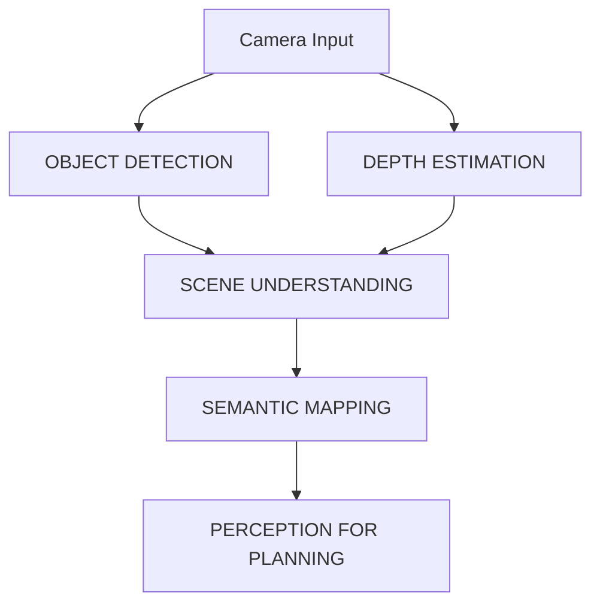

# Vision-Language-Action (VLA) Introduction

## Understanding Vision-Language-Action Systems

Vision-Language-Action (VLA) systems represent a significant advancement in Physical AI, enabling robots to understand natural language commands, perceive their environment visually, and execute appropriate actions. For humanoid robotics, VLA systems are particularly important as they allow for more natural human-robot interaction, enabling robots to perform complex tasks based on verbal instructions.

### The VLA Framework

VLA systems operate on a closed-loop principle involving three interconnected components:

1. **Vision**: Processing visual information from the environment
2. **Language**: Understanding natural language commands and context
3. **Action**: Executing appropriate robot behaviors

The integration of these components allows humanoid robots to:
- Interpret natural language instructions
- Recognize objects and spatial relationships in their environment
- Plan and execute complex behaviors to achieve requested goals
- Adapt to dynamic environments while maintaining task focus

### VLA in Physical AI Context

In Physical AI applications, VLA systems embody the principle of intelligence emerging from the interaction between perception, cognition, and action. Rather than treating these as separate modules, VLA systems create tight coupling between perception and action, guided by language understanding.

This approach is particularly effective for humanoid robotics because:
- Humanoid robots can exhibit human-like behavior patterns
- Language interface matches natural human communication modalities
- Embodied behaviors connect language to physical reality
- Complex manipulation and navigation tasks can be described and executed through language

## Components of VLA Systems

### Language Understanding

The language component of VLA systems processes natural language input to extract:
- **Commands**: Specific actions to perform ("pick up the red cube")
- **Targets**: Objects or locations to interact with
- **Constraints**: Spatial, temporal, or contextual limitations
- **Context**: Situational information affecting interpretation

#### Natural Language Processing Pipeline


For humanoid robots, this pipeline must account for:
- **Spatial Language**: Understanding directions ("left", "right", "behind")
- **Deictic References**: Processing pointing and demonstrative language ("that one")
- **Temporal Sequences**: Handling multi-step instructions
- **Embodied Semantics**: Connecting language to physical affordances

### Vision Processing

The vision component processes visual information to:
- Recognize objects and their affordances
- Understand spatial relationships and scene layout
- Track dynamic elements in the environment
- Provide feedback during action execution

#### Vision Processing Pipeline



For humanoid robotics applications, vision processing must:
- Handle egocentric (first-person) perspectives
- Process multiple camera views for complete scene understanding
- Identify graspable objects and navigable paths
- Track objects and humans during interaction

### Action Generation

The action component translates the interpreted command and scene understanding into:
- Low-level control commands for robot joints
- Path planning for navigation
- Grasp planning for manipulation
- Behavior sequencing for complex tasks

## VLA Architecture for Humanoid Robots

### System Overview

The architecture of a VLA system for humanoid robotics typically follows this pattern:

```
┌─────────────────┐    ┌──────────────────┐    ┌─────────────────┐
│   Language      │    │  Multimodal     │    │    Action       │
│  Understanding  │───▶│  Fusion &       │───▶│  Generation     │
│                 │    │  Grounding      │    │                 │
└─────────────────┘    └──────────────────┘    └─────────────────┘
         ▲                       │                        ▼
         │                       ▼                        │
┌─────────────────┐    ┌──────────────────┐    ┌─────────────────┐
│                 │    │                  │    │                 │
│ Human Language  │    │   Robot State    │    │ Robot Control   │
│   Commands      │    │   & Perception   │    │    Actions      │
│                 │    │                  │    │                 │
└─────────────────┘    └──────────────────┘    └─────────────────┘
```

### Language Understanding Module

The language understanding module processes natural language commands through several stages:

#### 1. Speech-to-Text Processing
For spoken language input, the system may use transcription services like OpenAI's Whisper:
```python
import whisper

# Load model
model = whisper.load_model("medium")

# Transcribe audio
result = model.transcribe("command_audio.wav")
command_text = result["text"]
```

#### 2. Intent Recognition
Identifying the core action requested by the user:
- **Navigation**: "Go to the kitchen", "Walk to the table"
- **Manipulation**: "Pick up the ball", "Place the object in the box"
- **Interaction**: "Wave to the person", "Follow the human"
- **Composite**: "Go to the table and pick up the red cup"

#### 3. Entity Resolution
Mapping language references to specific objects in the environment:
- Determining which object corresponds to "the ball" among several round objects
- Identifying spatial relationships like "the ball next to the cube"
- Handling dynamic reference resolution during task execution

### Vision Processing Module

The vision module processes visual information for VLA systems:

#### 1. Object Detection and Recognition
Using models like YOLO, Mask R-CNN, or specialized robotic perception models:
```python
import torch
import torchvision

# Example using a pre-trained model
model = torchvision.models.detection.maskrcnn_resnet50_fpn(pretrained=True)
model.eval()

# Process image to detect objects and their locations
detections = model(image_tensor)
```

#### 2. Spatial Reasoning
Understanding spatial relationships:
- Relative positions ("the cup is to the left of the plate")
- Navigable space vs. obstacles
- Reachable vs. unreachable objects
- Affordances of objects for manipulation

#### 3. Scene Understanding
Building a comprehensive understanding of the environment:
- Semantic mapping of spaces (living room, kitchen, hallway)
- Functional zones (sitting area, cooking area)
- Object placement patterns (objects typically found in specific locations)

### Multimodal Fusion and Grounding

The core innovation in VLA systems is the tight integration of vision and language processing:

#### 1. Language-Guided Visual Attention
The language command directs which visual elements to focus on:
- "The red ball" activates attention mechanisms to focus on red, ball-shaped objects
- "Behind the couch" emphasizes the region behind detected couches
- "The cup you saw earlier" maintains attention on previously seen objects

#### 2. Contextual Grounding
Connecting language concepts to perceptual reality:
- Grounding "large object" in terms of actual size measurements
- Connecting "smooth surface" to specific visual/textural features
- Associating "stable grasp" with geometric and physical properties

#### 3. Embodied Cognition
Ensuring language understanding incorporates robot embodiment:
- Understanding spatial language relative to robot's perspective
- Interpreting actions in terms of robot capabilities
- Grounding commands in robot's environmental affordances

## Implementing VLA Systems

### System Architecture Pattern

A typical VLA implementation for humanoid robotics follows this architectural pattern:

```python
class VisionLanguageActionSystem:
    def __init__(self):
        # Initialize components
        self.speech_recognizer = WhisperRecognizer()
        self.language_processor = LanguageProcessor()
        self.vision_processor = VisionProcessor()
        self.action_generator = ActionGenerator()
        self.behavior_executer = BehaviorExecutor()
    
    def process_command(self, audio_input=None, text_input=None):
        # Step 1: Get language input
        if audio_input is not None:
            text_input = self.speech_recognizer.transcribe(audio_input)
        
        # Step 2: Parse language command
        parsed_command = self.language_processor.parse(text_input)
        
        # Step 3: Acquire and process visual information
        visual_info = self.vision_processor.perceive_environment()
        
        # Step 4: Ground language in perception
        grounded_command = self.multimodal_fusion(
            parsed_command, 
            visual_info,
            robot_state=self.get_robot_state()
        )
        
        # Step 5: Generate action sequence
        action_sequence = self.action_generator.generate_actions(
            grounded_command,
            visual_info
        )
        
        # Step 6: Execute behavior
        success = self.behavior_executer.execute(
            action_sequence,
            feedback_handler=self.vision_processor
        )
        
        return success
    
    def multimodal_fusion(self, language_parsed, visual_info, robot_state):
        """Fuses language understanding with visual perception"""
        # 1. Object grounding: match language references to visual objects
        grounded_objects = self.ground_language_references(
            language_parsed.objects, 
            visual_info.objects
        )
        
        # 2. Spatial grounding: interpret spatial relations
        spatial_constraints = self.ground_spatial_relations(
            language_parsed.spatial,
            visual_info.layout,
            robot_state
        )
        
        # 3. Capability grounding: ensure actions are feasible
        feasible_actions = self.ground_feasibility(
            language_parsed.actions,
            robot_state.capabilities
        )
        
        # Combine all grounded information
        return {
            'objects': grounded_objects,
            'relations': spatial_constraints,
            'actions': feasible_actions,
            'context': language_parsed.context
        }
```

### Advanced VLA Techniques

#### 1. Foundation Models for VLA

Recent advances employ large foundation models that jointly learn vision, language, and action:
- **RT-1**: Robotics Transformer for generalization across tasks
- **BC-Z**: Behavioral Cloning with zero-shot generalization
- **InstructPix2Pix**: Instruction-guided image editing applied to robotic control

#### 2. Visual Prompting

Using visual examples to guide model behavior:
- Demonstrating desired behavior through visual examples
- Few-shot learning for new environments or tasks
- Adapting to novel objects through visual analogies

#### 3. World Models Integration

Incorporating predictive world models for better planning:
- Anticipating the consequences of actions
- Handling delayed feedback in complex tasks
- Improving robustness to environmental changes

## Humanoid Robotics Considerations

### Embodied Language Understanding

Humanoid robots have unique characteristics that affect VLA system design:

#### Perspective Taking
- Understanding language from the robot's visual perspective
- Handling differences between robot and human viewpoints
- Managing gaze direction and attention patterns

#### Social Interaction
- Processing conversational context and turn-taking
- Understanding gesture and posture alongside language
- Handling multiple speakers in social environments

#### Physical Capabilities
- Grounding language in robot's actual physical abilities
- Understanding the difference between human and robot capabilities
- Handling commands that exceed robot capabilities gracefully

### Bimanual Manipulation

Humanoid robots' dual-arm setup allows for complex manipulation:
- Understanding commands for coordinated bimanual actions
- Managing handedness (left/right hand specialization)
- Executing complex manipulation sequences

### Locomotion and Navigation

Integrating navigation with language understanding:
- Processing path descriptions ("go straight until you see the table")
- Handling dynamic obstacle avoidance
- Understanding spatial language in 3D environments

## Integration with ROS/ROS2

### Message Types and Interfaces

VLA systems typically interface with ROS through standard message types:

```yaml
# Vision-Language-Action Command Message
std_msgs/Header header
string language_command      # Raw natural language input
geometry_msgs/PoseStamped target_location  # Location if specified
object_msgs/Object target_object         # Target object if specified
string action_type           # High-level action type (NAVIGATE, MANIPULATE, etc.)
float32[] parameters         # Additional parameters for the action
```

### Service Architecture

A service-based approach allows for modular VLA systems:

```yaml
# VLA Command Service
string command
---
bool success
string message
geometry_msgs/Pose[] action_path  # Planned navigation path if applicable
int32[] object_ids                # IDs of affected objects
```

### Topic Architecture

Common topics for VLA systems include:

- `/vla/command` (std_msgs/String) - Natural language commands
- `/vla/target_object` (object_msgs/Object) - Selected target objects
- `/vla/execution_feedback` (std_msgs/String) - Execution status
- `/vla/system_state` (std_msgs/String) - Current VLA system state

## Evaluation and Testing

### Performance Metrics

VLA systems for humanoid robots should be evaluated using:

#### Task Success Rate
- Percentage of tasks completed as requested
- Handling of ambiguous or incorrect commands
- Recovery from execution failures

#### Language Understanding Accuracy
- Correct parsing of action verbs
- Proper resolution of object references
- Accurate interpretation of spatial relations

#### Visual Grounding Accuracy
- Correct identification of target objects
- Accurate localization of spatial references
- Robustness to environmental variations

#### Execution Efficiency
- Time to complete tasks
- Number of attempts needed for success
- Resource utilization (computation, energy)

### Benchmarking Tasks

Standard evaluation tasks for humanoid VLA systems include:

#### Navigation Tasks
- "Go to the red chair"
- "Navigate to the area near the window"
- "Find a path around the obstacle to reach the goal"

#### Manipulation Tasks  
- "Pick up the green ball"
- "Move the book from the table to the shelf"
- "Arrange these objects in a line"

#### Composite Tasks
- "Go to the kitchen and bring me the apple from the counter"
- "Find the person wearing blue and follow them for 5 meters"
- "Open the door, walk through, and close it behind you"

## Challenges and Limitations

### Real-Time Processing

VLA systems face significant computational demands:
- Processing visual input in real-time
- Running large language models efficiently
- Maintaining high frequency control loops

### Ambiguity Resolution

Natural language often contains ambiguities:
- Unclear object references ("that one")
- Implicit spatial relationships ("over there")
- Missing contextual information

### Domain Transfer

Systems trained in simulation may struggle with:
- Differences in visual appearance
- Variations in language use
- Physical reality constraints

### Safety Considerations

VLA systems must incorporate safety checks:
- Validation of action feasibility
- Collision avoidance during execution
- Handling of unsafe commands

## Future Directions

### Advanced Foundation Models

Future developments include:
- Larger multimodal foundation models
- Better world modeling capabilities
- Improved long-horizon planning

### Lifelong Learning

Systems that continuously improve:
- Learning from interaction failures
- Adapting to new environments
- Expanding vocabulary and capabilities

### Social Intelligence

Enhanced understanding of social contexts:
- Collaborative task execution
- Understanding human intentions
- Adapting to user preferences

## Summary

Vision-Language-Action systems represent a critical component of Physical AI for humanoid robots. By tightly integrating perception, language understanding, and action generation, VLA systems enable more natural and flexible human-robot interaction. Successful implementation requires careful attention to multimodal fusion, embodiment considerations, and real-time performance requirements.

In the following sections, we'll explore specific implementations of VLA components, including speech processing with Whisper, cognitive planning with LLMs, and integration techniques for mapping language to robot actions.