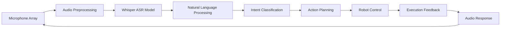

# Whisper Integration for Voice Commands

## Introduction to Voice-to-Action in Physical AI

Voice interfaces represent one of the most natural forms of human-robot interaction, enabling users to communicate with robotic systems using everyday language. In the context of Physical AI and humanoid robotics, speech recognition systems that can reliably convert spoken commands to actionable instructions are critical for creating seamless human-robot collaboration.

### Why Whisper for Voice Commands?

OpenAI's Whisper ASR (Automatic Speech Recognition) model offers several advantages for Physical AI applications:

1. **Multilingual Support**: Handles multiple languages, enabling international robotics applications
2. **Robustness**: Performs well in various acoustic environments and with different accents
3. **Open Source**: Fully accessible for customization and integration
4. **Pre-trained Quality**: High accuracy without requiring extensive training data
5. **Real-time Capabilities**: Can operate with low latency for interactive applications

### Voice Command Processing Pipeline

The complete voice-to-action pipeline for Physical AI involves:

1. **Audio Capture**: Collecting speech from microphones or audio streams
2. **Speech Recognition**: Converting speech to text using Whisper
3. **Language Understanding**: Interpreting the meaning of the text command
4. **Action Mapping**: Translating understood commands to robot actions
5. **Execution**: Performing the requested robot behaviors
6. **Feedback**: Providing confirmation or status updates

## Whisper Implementation in Robotics

### Technical Architecture



### Whisper Model Selection

For robotics applications, different Whisper model variants offer trade-offs between performance and computational requirements:

- **Whisper Tiny**: Fastest model, suitable for edge deployment (39M parameters)
- **Whisper Base**: Good balance of speed and accuracy (74M parameters)
- **Whisper Small**: Higher quality with reasonable speed (244M parameters)
- **Whisper Medium**: High quality, good for reliable applications (769M parameters)
- **Whisper Large**: Highest quality, suitable for critical applications (1550M parameters)

For humanoid robotics applications, the choice depends on computational constraints and accuracy requirements:

```python
import whisper
import torch

# Select appropriate model based on computational constraints
def load_whisper_model(robot_class="lightweight"):
    if robot_class == "lightweight":
        # For edge devices or real-time applications
        return whisper.load_model("tiny")
    elif robot_class == "standard":
        # For most humanoid applications
        return whisper.load_model("small")
    elif robot_class == "precision":
        # For applications requiring high accuracy
        return whisper.load_model("large")
    else:
        # Default model
        return whisper.load_model("base")
```

### Audio Preprocessing for Robotics

Robotic environments present unique challenges for audio processing:

#### Noise Reduction
- **Robot Motor Noise**: Filtering out mechanical sounds
- **Environmental Noise**: Handling ambient sounds in the workspace
- **Echo Cancellation**: Managing acoustic reflections

#### Direction of Arrival (DOA) Processing
- **Beamforming**: Focusing on speaker direction
- **Speaker Separation**: Distinguishing between multiple speakers
- **Tracking**: Following a speaker as they move

#### Audio Stream Processing
```python
import numpy as np
import librosa
from scipy import signal

class AudioPreprocessor:
    def __init__(self, sample_rate=16000, chunk_size=1024):
        self.sample_rate = sample_rate
        self.chunk_size = chunk_size
        self.audio_buffer = np.array([])
        
        # Noise reduction parameters
        self.noise_threshold = 0.01  # RMS threshold for silence detection
        
        # Initialize filter for robot motor noise
        nyquist = sample_rate / 2
        # Typical motor noise is below 100 Hz
        self.low_freq_filter = signal.butter(
            3, 100/nyquist, btype='highpass', output='sos'
        )
    
    def preprocess_audio(self, raw_audio):
        """Preprocess audio for Whisper ASR"""
        # Apply noise reduction filters
        filtered_audio = signal.sosfilt(self.low_freq_filter, raw_audio)
        
        # Normalize amplitude
        rms = np.sqrt(np.mean(filtered_audio**2))
        if rms > self.noise_threshold:
            # Normalize to prevent clipping
            max_val = np.max(np.abs(filtered_audio))
            if max_val > 0:
                filtered_audio = filtered_audio / max_val
        else:
            # Audio is too quiet, return zeros
            filtered_audio = np.zeros_like(filtered_audio)
        
        return filtered_audio.astype(np.float32)
    
    def buffer_audio_chunks(self, audio_chunk):
        """Buffer incoming audio chunks for processing"""
        self.audio_buffer = np.append(self.audio_buffer, audio_chunk)
        
        # Process when we have enough audio (1-2 seconds worth)
        samples_needed = int(self.sample_rate * 1.5)  # 1.5 seconds
        if len(self.audio_buffer) >= samples_needed:
            audio_segment = self.audio_buffer[:samples_needed]
            self.audio_buffer = self.audio_buffer[samples_needed:]
            return audio_segment
        else:
            return None
```

## Real-time Whisper Integration

### Streaming ASR Implementation

For continuous listening and real-time command processing:

```python
import threading
import queue
import time
from dataclasses import dataclass
from typing import Optional

@dataclass
class VoiceCommand:
    text: str
    confidence: float
    timestamp: float
    speaker_id: Optional[str] = None

class StreamingWhisperInterface:
    def __init__(self, model_size="small"):
        self.model = whisper.load_model(model_size)
        self.audio_queue = queue.Queue()
        self.command_queue = queue.Queue()
        self.is_listening = False
        self.listening_thread = None
        
        # Audio preprocessing
        self.preprocessor = AudioPreprocessor()
        
        # Keywords that trigger processing
        self.wake_words = ["robot", "hey robot", "please", "execute"]
        
        # Confidence threshold for accepting commands
        self.confidence_threshold = 0.7
        
    def start_listening(self):
        """Start the streaming audio processing"""
        self.is_listening = True
        self.listening_thread = threading.Thread(target=self._audio_processing_loop)
        self.listening_thread.daemon = True
        self.listening_thread.start()
        
    def stop_listening(self):
        """Stop the streaming audio processing"""
        self.is_listening = False
        if self.listening_thread:
            self.listening_thread.join()
    
    def _audio_processing_loop(self):
        """Main loop for processing audio streams"""
        while self.is_listening:
            try:
                # Get audio from queue (non-blocking with timeout)
                audio_chunk = self.audio_queue.get(timeout=0.1)
                
                # Process the audio chunk
                processed_audio = self.preprocessor.preprocess_audio(audio_chunk)
                
                # Check if we have enough audio to process
                audio_segment = self.preprocessor.buffer_audio_chunks(processed_audio)
                if audio_segment is not None:
                    # Run Whisper to transcribe the segment
                    result = self.model.transcribe(
                        audio_segment, 
                        language="en",  # Could be dynamic based on application
                        temperature=0.0,  # Deterministic output
                        compression_ratio_threshold=2.0,  # Filter out poor quality transcriptions
                        logprob_threshold=-1.0,  # Filter out low confidence
                        no_speech_threshold=0.6  # Filter out silence
                    )
                    
                    # Check if we got a valid transcription
                    if result and result["text"].strip():
                        confidence = self._estimate_confidence(result)
                        
                        # Create voice command if confidence is high enough
                        if confidence > self.confidence_threshold:
                            command = VoiceCommand(
                                text=result["text"].strip(),
                                confidence=confidence,
                                timestamp=time.time()
                            )
                            
                            # Check if this command should be processed
                            if self._should_process_command(command):
                                self.command_queue.put(command)
                                
            except queue.Empty:
                continue
            except Exception as e:
                print(f"Error in audio processing: {e}")
                continue
    
    def _estimate_confidence(self, whisper_result):
        """Estimate confidence from Whisper results"""
        # Combine multiple confidence indicators
        if "avg_logprob" in whisper_result:
            # Negative log probabilities (higher is better)
            avg_logprob = whisper_result["avg_logprob"]
            # Convert to confidence score between 0 and 1
            confidence = max(0.0, min(1.0, (avg_logprob + 2.0) / 4.0))  # Normalize from roughly -2 to 2
        else:
            # Default to medium confidence
            confidence = 0.5
        
        return confidence
    
    def _should_process_command(self, command):
        """Determine if a command should be processed"""
        text_lower = command.text.lower()
        
        # Check for wake words
        for wake_word in self.wake_words:
            if wake_word in text_lower:
                return True
        
        # Check for explicit commands
        explicit_indicators = ["go to", "move", "pick", "place", "grasp", "navigate", "help"]
        for indicator in explicit_indicators:
            if indicator in text_lower:
                return True
        
        # If no clear indicator but confidence is very high, consider processing
        if command.confidence > 0.9:
            return True
        
        return False
    
    def get_voice_commands(self):
        """Retrieve available voice commands"""
        commands = []
        while not self.command_queue.empty():
            try:
                command = self.command_queue.get_nowait()
                commands.append(command)
            except queue.Empty:
                break
        return commands

# Example of integration with ROS
import rclpy
from rclpy.node import Node
from std_msgs.msg import String
from audio_common_msgs.msg import AudioData

class WhisperROSInterface(Node):
    def __init__(self):
        super().__init__('whisper_ros_interface')
        
        # Initialize Whisper interface
        self.whisper_interface = StreamingWhisperInterface(model_size="small")
        
        # Subscribe to audio stream
        self.audio_sub = self.create_subscription(
            AudioData,
            '/microphone/audio_raw',
            self.audio_callback,
            10
        )
        
        # Publisher for recognized commands
        self.command_pub = self.create_publisher(String, '/voice_commands', 10)
        
        # Start listening
        self.whisper_interface.start_listening()
        
        # Timer for checking for new commands
        self.command_check_timer = self.create_timer(0.1, self.check_for_commands)
    
    def audio_callback(self, msg):
        """Process incoming audio data"""
        # Convert ROS audio message to numpy array
        audio_data = np.frombuffer(msg.data, dtype=np.int16).astype(np.float32) / 32768.0
        audio_data = librosa.resample(audio_data, orig_sr=44100, target_sr=16000)
        
        # Add to Whisper processing queue
        self.whisper_interface.audio_queue.put(audio_data)
    
    def check_for_commands(self):
        """Check for new voice commands and publish them"""
        commands = self.whisper_interface.get_voice_commands()
        
        for command in commands:
            # Publish recognized command
            cmd_msg = String()
            cmd_msg.data = command.text
            self.command_pub.publish(cmd_msg)
            
            self.get_logger().info(f'Recognized command: "{command.text}" (confidence: {command.confidence:.2f})')
```

## Context-Sensitive Command Processing

### Command Understanding Pipeline

For Physical AI applications, simply recognizing speech is insufficient—we need to understand the context and meaning of commands:

```python
from dataclasses import dataclass
from typing import Dict, List, Optional
import re

@dataclass
class ParsedCommand:
    action_type: str  # "navigation", "manipulation", "interaction", etc.
    target_object: Optional[str] = None
    target_location: Optional[str] = None
    modifiers: List[str] = None
    confidence: float = 0.0

class CommandParser:
    def __init__(self):
        # Define action patterns
        self.action_patterns = {
            'navigation': [
                r'\bgo to\b', r'\bwalk to\b', r'\bmove to\b', r'\bnavigate to\b',
                r'\bhead to\b', r'\btravel to\b', r'\bdirect to\b'
            ],
            'manipulation': [
                r'\bpick up\b', r'\bgrasp\b', r'\bcapture\b', r'\blift\b',
                r'\bgrab\b', r'\btake\b', r'\bhold\b', r'\bcarry\b'
            ],
            'placement': [
                r'\bplace\b', r'\bput\b', r'\bset\b', r'\bdrop\b',
                r'\brelease\b', r'\bdeposit\b'
            ],
            'navigation_help': [
                r'\bhelp me navigate\b', r'\bguide me\b', r'\bassist with navigation\b'
            ],
            'object_interaction': [
                r'\binteract with\b', r'\bengage\b', r'\bapproach\b', r'\bopen\b', r'\bclose\b'
            ]
        }
        
        # Define location patterns
        self.location_patterns = [
            r'\b(kitchen|living room|bedroom|office|bathroom|hallway)\b',
            r'\b(table|chair|couch|counter|shelf|desk|bed)\b',
            r'\b(inside|outside|near|by|next to|beside|behind|in front of)\b'
        ]
        
        # Define object patterns
        self.object_patterns = [
            r'\b(ball|cube|block|cup|bottle|book|box|toy|tool)\b',
            r'\b(red|blue|green|yellow|white|black|orange|purple|pink|brown)\b'
        ]
    
    def parse_command(self, text: str) -> Optional[ParsedCommand]:
        """Parse a natural language command into structured components"""
        text_lower = text.lower().strip()
        
        # Identify action type
        action_type = self._identify_action_type(text_lower)
        if not action_type:
            return None  # Couldn't identify a valid action
        
        # Extract target object
        target_object = self._extract_target_object(text_lower)
        
        # Extract target location
        target_location = self._extract_target_location(text_lower)
        
        # Extract modifiers (adverbs, additional constraints)
        modifiers = self._extract_modifiers(text_lower)
        
        return ParsedCommand(
            action_type=action_type,
            target_object=target_object,
            target_location=target_location,
            modifiers=modifiers,
            confidence=0.8  # Default confidence for now
        )
    
    def _identify_action_type(self, text: str) -> Optional[str]:
        """Identify the primary action type from text"""
        for action_type, patterns in self.action_patterns.items():
            for pattern in patterns:
                if re.search(pattern, text):
                    return action_type
        return None
    
    def _extract_target_object(self, text: str) -> Optional[str]:
        """Extract potential target object from text"""
        for pattern in self.object_patterns:
            match = re.search(pattern, text)
            if match:
                return match.group(0)
        return None
    
    def _extract_target_location(self, text: str) -> Optional[str]:
        """Extract potential target location from text"""
        for pattern in self.location_patterns:
            match = re.search(pattern, text)
            if match:
                # Include surrounding context for better identification
                start = max(0, match.start() - 10)
                end = min(len(text), match.end() + 10)
                return text[start:end].strip()
        return None
    
    def _extract_modifiers(self, text: str) -> List[str]:
        """Extract additional modifiers from text"""
        # Look for adverbs and additional constraints
        modifier_pattern = r'\b(quickly|slowly|carefully|gently|fast|slow|careful)\b|\b(more|less|very|extremely|quite)\b'
        matches = re.findall(modifier_pattern, text)
        return matches

# Example usage
def process_voice_command(whisper_text: str) -> Optional[ParsedCommand]:
    """Process a voice command from Whisper through the full pipeline"""
    parser = CommandParser()
    parsed_command = parser.parse_command(whisper_text)
    return parsed_command
```

### Integration with World Understanding

Commands must be interpreted in the context of the robot's understanding of the world:

```python
class ContextAwareCommandProcessor:
    def __init__(self):
        self.command_parser = CommandParser()
        self.world_model = WorldModel()  # Would contain knowledge of objects, locations
        self.robot_state = RobotState()  # Would contain current robot capabilities and location
    
    def process_command_with_context(self, command_text: str) -> Optional[RobotAction]:
        """Process command considering world context"""
        # Parse the command
        parsed_cmd = self.command_parser.parse_command(command_text)
        if not parsed_cmd:
            return None
        
        # Resolve ambiguous references using world model
        resolved_cmd = self._resolve_command_context(parsed_cmd)
        
        # Generate robot action plan
        robot_action = self._generate_robot_action(resolved_cmd)
        
        return robot_action
    
    def _resolve_command_context(self, parsed_cmd: ParsedCommand) -> ParsedCommand:
        """Resolve ambiguous references using world knowledge"""
        # Resolve object references (e.g., "the ball" -> specific ball instance)
        if parsed_cmd.target_object:
            possible_objects = self.world_model.get_visible_objects_by_category(
                parsed_cmd.target_object
            )
            
            if len(possible_objects) == 1:
                # Unambiguous - use the single object
                parsed_cmd.target_object = possible_objects[0].id
            elif len(possible_objects) > 1:
                # Ambiguous - need more context (e.g., spatial description)
                # For now, use the closest one
                closest_obj = min(
                    possible_objects, 
                    key=lambda obj: self._distance_to_robot(obj.position)
                )
                parsed_cmd.target_object = closest_obj.id
            else:
                # No matching objects - command invalid
                raise ValueError(f"No {parsed_cmd.target_object} found in environment")
        
        # Resolve spatial references (e.g., "the table near me" vs "the table far away")
        if parsed_cmd.target_location:
            possible_locations = self.world_model.get_locations_by_name(
                parsed_cmd.target_location
            )
            
            if len(possible_locations) > 1:
                # Use spatial relation context to disambiguate
                # This would involve more complex spatial reasoning
                pass
        
        return parsed_cmd
    
    def _generate_robot_action(self, resolved_cmd: ParsedCommand) -> RobotAction:
        """Generate a robot action based on the resolved command"""
        if resolved_cmd.action_type == 'navigation':
            target_pose = self._get_pose_for_location(resolved_cmd.target_location)
            return NavigationAction(
                target_pose=target_pose,
                speed_modifier=self._get_speed_modifier(resolved_cmd)
            )
        elif resolved_cmd.action_type == 'manipulation':
            target_object = self._get_object_for_manipulation(resolved_cmd.target_object)
            return ManipulationAction(
                target_object=target_object,
                action_type='grasp'
            )
        elif resolved_cmd.action_type == 'placement':
            target_location = self._get_pose_for_location(resolved_cmd.target_location)
            return ManipulationAction(
                target_object=self.robot_state.held_object,
                action_type='place',
                target_location=target_location
            )
        else:
            raise ValueError(f"Unknown action type: {resolved_cmd.action_type}")
    
    def _get_pose_for_location(self, location_name: str) -> Pose:
        """Get the pose for a named location"""
        # Query world model for location pose
        location = self.world_model.get_location_by_name(location_name)
        return location.pose
    
    def _get_object_for_manipulation(self, object_id: str) -> ObjectInfo:
        """Get object information for manipulation"""
        obj = self.world_model.get_object_by_id(object_id)
        return obj
    
    def _get_speed_modifier(self, parsed_cmd: ParsedCommand) -> float:
        """Get speed modifier based on command modifiers"""
        if 'slowly' in parsed_cmd.modifiers or 'carefully' in parsed_cmd.modifiers:
            return 0.3  # Slow speed
        elif 'quickly' in parsed_cmd.modifiers or 'fast' in parsed_cmd.modifiers:
            return 1.0  # Fast speed
        else:
            return 0.7  # Default speed
    
    def _distance_to_robot(self, obj_position) -> float:
        """Calculate distance from robot to object"""
        robot_pos = self.robot_state.position
        return ((obj_position.x - robot_pos.x)**2 + 
                (obj_position.y - robot_pos.y)**2)**0.5
```

## Integration with ROS/ROS2

### Whisper Node Implementation

A complete ROS node implementation for Whisper integration:

```python
#!/usr/bin/env python3
"""
Whisper ASR Node for Physical AI Humanoid Robots
Handles voice command recognition and parsing for robot control
"""

import rclpy
from rclpy.node import Node
from rclpy.qos import QoSProfile, QoSDurabilityPolicy
from std_msgs.msg import String
from audio_common_msgs.msg import AudioData
from sensor_msgs.msg import Image
from geometry_msgs.msg import Pose, Point
from shu_msgs.msg import RobotCommand, RobotCommandArray
import numpy as np
import whisper
import torch
import threading
import queue
import time
import json
import librosa
from dataclasses import asdict

class WhisperASRNode(Node):
    def __init__(self):
        super().__init__('whisper_asr_node')
        
        # Parameters
        self.model_size = self.declare_parameter('model_size', 'small').value
        self.sample_rate = self.declare_parameter('sample_rate', 16000).value
        self.confidence_threshold = self.declare_parameter('confidence_threshold', 0.7).value
        self.language = self.declare_parameter('language', 'en').value
        
        # Initialize Whisper model
        self.get_logger().info(f'Loading Whisper model: {self.model_size}')
        self.device = "cuda" if torch.cuda.is_available() else "cpu"
        self.model = whisper.load_model(self.model_size).to(self.device)
        
        # Audio buffer and processing
        self.audio_queue = queue.Queue()
        self.is_listening = False
        self.listening_thread = None
        self.preprocessor = AudioPreprocessor(sample_rate=self.sample_rate)
        
        # Publishers
        self.transcription_pub = self.create_publisher(String, 'speech_transcriptions', 10)
        self.commands_pub = self.create_publisher(RobotCommandArray, 'robot_commands', 10)
        
        # Subscribers
        self.audio_sub = self.create_subscription(
            AudioData,
            'audio_input',
            self.audio_callback,
            10
        )
        
        # Start processing thread
        self.is_listening = True
        self.listening_thread = threading.Thread(target=self.process_audio_stream, daemon=True)
        self.listening_thread.start()
        
        self.get_logger().info('Whisper ASR node initialized')
    
    def audio_callback(self, msg: AudioData):
        """Callback for incoming audio data"""
        try:
            # Convert audio data to numpy array
            if msg.encoding == 'PCM_16':
                # Convert from int16 to float32
                audio_data = np.frombuffer(msg.data, dtype=np.int16).astype(np.float32) / 32768.0
                
                # Resample if needed
                if msg.sample_rate != self.sample_rate:
                    audio_data = librosa.resample(
                        audio_data, 
                        orig_sr=msg.sample_rate, 
                        target_sr=self.sample_rate
                    )
                
                # Add to processing queue
                self.audio_queue.put(audio_data)
            else:
                self.get_logger().warn(f'Unsupported audio encoding: {msg.encoding}')
        except Exception as e:
            self.get_logger().error(f'Error processing audio: {e}')
    
    def process_audio_stream(self):
        """Process audio stream in separate thread"""
        audio_buffer = np.array([])
        buffer_duration = 2.0  # Process 2-second chunks
        
        while self.is_listening:
            try:
                # Get audio from queue
                chunk = self.audio_queue.get(timeout=0.1)
                audio_buffer = np.append(audio_buffer, chunk)
                
                # Process when buffer has enough data
                required_samples = int(self.sample_rate * buffer_duration)
                if len(audio_buffer) >= required_samples:
                    # Process the buffered audio
                    segment = audio_buffer[:required_samples]
                    audio_buffer = audio_buffer[required_samples:]
                    
                    # Preprocess the audio
                    processed_segment = self.preprocessor.preprocess_audio(segment)
                    
                    # Run Whisper ASR
                    result = self.model.transcribe(
                        processed_segment,
                        language=self.language,
                        temperature=0.0,
                        compression_ratio_threshold=2.0,
                        logprob_threshold=-1.0,
                        no_speech_threshold=0.6
                    )
                    
                    # Process the result
                    if result and result["text"].strip():
                        text = result["text"].strip()
                        confidence = self._estimate_whisper_confidence(result)
                        
                        if confidence > self.confidence_threshold:
                            self.handle_transcription(text, confidence)
                        
            except queue.Empty:
                continue
            except Exception as e:
                self.get_logger().error(f'Error in audio processing thread: {e}')
    
    def _estimate_whisper_confidence(self, result):
        """Estimate confidence from Whisper result"""
        # Use avg_logprob as confidence measure
        if "avg_logprob" in result:
            avg_logprob = result["avg_logprob"]
            # Normalize logprob to 0-1 confidence range
            # Logprob is typically negative, more negative is worse
            normalized = max(0.0, min(1.0, (avg_logprob + 2.0) / 3.0))
            return normalized
        else:
            return 0.5  # Default confidence
    
    def handle_transcription(self, text: str, confidence: float):
        """Handle a completed transcription"""
        self.get_logger().info(f'Transcribed: "{text}" (conf: {confidence:.2f})')
        
        # Publish transcription
        transcription_msg = String()
        transcription_msg.data = text
        self.transcription_pub.publish(transcription_msg)
        
        # Parse and convert to robot commands
        try:
            processor = ContextAwareCommandProcessor()
            robot_action = processor.process_command_with_context(text)
            
            if robot_action:
                # Convert to ROS message and publish
                commands_msg = self._convert_action_to_ros(robot_action)
                self.commands_pub.publish(commands_msg)
            else:
                self.get_logger().warn(f'Could not parse command: "{text}"')
        except Exception as e:
            self.get_logger().error(f'Error processing command: {e}')
    
    def _convert_action_to_ros(self, robot_action) -> RobotCommandArray:
        """Convert internal action representation to ROS message"""
        commands_msg = RobotCommandArray()
        
        # Convert to appropriate RobotCommand messages based on action type
        cmd = RobotCommand()
        cmd.command_type = robot_action.type
        cmd.confidence = 1.0  # From successful parsing
        
        # Add parameters based on action type
        if robot_action.type == 'NAVIGATION':
            cmd.target_pose = robot_action.target_pose
        elif robot_action.type == 'MANIPULATION':
            cmd.target_object = json.dumps(asdict(robot_action.target_object))
        
        # Add to array
        commands_msg.commands = [cmd]
        
        return commands_msg
    
    def destroy_node(self):
        """Clean shutdown"""
        self.is_listening = False
        if self.listening_thread:
            self.listening_thread.join()
        super().destroy_node()

def main(args=None):
    rclpy.init(args=args)
    
    node = WhisperASRNode()
    
    try:
        rclpy.spin(node)
    except KeyboardInterrupt:
        pass
    finally:
        node.destroy_node()
        rclpy.shutdown()

if __name__ == '__main__':
    main()
```

### Launch File for Whisper Integration

```xml title="launch/whisper_integration.launch.py"
from launch import LaunchDescription
from launch.actions import DeclareLaunchArgument
from launch.substitutions import LaunchConfiguration
from launch_ros.actions import Node

def generate_launch_description():
    # Declare launch arguments
    model_size_arg = DeclareLaunchArgument(
        'model_size',
        default_value='small',
        description='Whisper model size (tiny, base, small, medium, large)'
    )
    
    confidence_threshold_arg = DeclareLaunchArgument(
        'confidence_threshold', 
        default_value='0.7',
        description='Minimum confidence for accepting transcriptions'
    )
    
    # Whisper ASR Node
    whisper_node = Node(
        package='shu_audio_perception',
        executable='whisper_asr_node',
        name='whisper_asr',
        parameters=[
            {'model_size': LaunchConfiguration('model_size')},
            {'confidence_threshold': LaunchConfiguration('confidence_threshold')},
            {'language': 'en'}
        ],
        remappings=[
            ('audio_input', '/microphone/audio_raw'),
            ('speech_transcriptions', '/voice_transcriptions'),
            ('robot_commands', '/parsed_voice_commands')
        ]
    )
    
    # Voice command processor (if separate)
    command_processor_node = Node(
        package='shu_behavior_tree',
        executable='voice_command_processor',
        name='voice_command_processor',
        parameters=[
            {'enable_context_aware': True}
        ],
        remappings=[
            ('parsed_voice_commands', '/parsed_voice_commands'),
            ('robot_tasks', '/robot_task_queue')
        ]
    )
    
    return LaunchDescription([
        model_size_arg,
        confidence_threshold_arg,
        whisper_node,
        command_processor_node
    ])
```

## Advanced Voice Processing Techniques

### Wake Word Detection

For more efficient processing, implement wake word detection before running Whisper:

```python
import collections
import webrtcvad  # Need to install with: pip install webrtcvad

class WakeWordDetector:
    def __init__(self, sample_rate=16000, vad_aggressiveness=3):
        self.sample_rate = sample_rate
        self.vad = webrtcvad.Vad(aggressiveness=vad_aggressiveness)
        self.wake_words = ["robot", "hey robot", "attention", "listen"]
        
        # For audio chunk processing
        self.frame_size = 10  # ms
        self.frame_bytes = int(2 * sample_rate * self.frame_size / 1000)  # 2 bytes per sample for int16
        self.audio_buffer = b""
        
        # Keep track of speech activity
        self.speech_frames = collections.deque(maxlen=30)  # About 300ms of frames
        
    def detect_activity(self, audio_chunk):
        """Detect if audio contains speech matching wake word pattern"""
        # Add chunk to buffer
        self.audio_buffer += audio_chunk
        
        # Process in frames
        while len(self.audio_buffer) >= self.frame_bytes:
            frame = self.audio_buffer[:self.frame_bytes]
            self.audio_buffer = self.audio_buffer[self.frame_bytes:]
            
            # Check if frame contains speech
            try:
                is_speech = self.vad.is_speech(frame, self.sample_rate)
                self.speech_frames.append(is_speech)
            except:
                # Invalid frame size
                continue
        
        # Check for speech activity pattern suggesting wake word
        speech_ratio = sum(self.speech_frames) / len(self.speech_frames) if self.speech_frames else 0
        
        # If we have sustained speech activity, trigger processing
        if speech_ratio > 0.3 and len(self.speech_frames) >= 5:
            return True  # Likely speech activity
            
        return False

class AdvancedWhisperInterface(StreamingWhisperInterface):
    def __init__(self, model_size="small"):
        super().__init__(model_size)
        
        # Add wake word detection
        self.wake_word_detector = WakeWordDetector()
        self.expecting_command = False
        self.activation_timeout = 5.0  # Expect command for 5 seconds after wake word
        self.activation_start_time = 0.0
    
    def _audio_processing_loop(self):
        """Enhanced processing loop with wake word detection"""
        while self.is_listening:
            try:
                # Get audio from queue
                audio_chunk = self.audio_queue.get(timeout=0.1)
                
                # Detect wake word activity
                if not self.expecting_command:
                    # Check for wake word pattern in audio
                    if self.wake_word_detector.detect_activity(audio_chunk):
                        self.get_logger().info('Wake word detected, activating listening mode')
                        self.expecting_command = True
                        self.activation_start_time = time.time()
                
                if self.expecting_command:
                    # Process with Whisper
                    processed_audio = self.preprocessor.preprocess_audio(audio_chunk)
                    audio_segment = self.preprocessor.buffer_audio_chunks(processed_audio)
                    
                    if audio_segment is not None:
                        result = self.model.transcribe(
                            audio_segment,
                            language="en",
                            temperature=0.0,
                            compression_ratio_threshold=2.0,
                            logprob_threshold=-1.0,
                            no_speech_threshold=0.6
                        )
                        
                        if result and result["text"].strip():
                            confidence = self._estimate_confidence(result)
                            if confidence > self.confidence_threshold:
                                command = VoiceCommand(
                                    text=result["text"].strip(),
                                    confidence=confidence,
                                    timestamp=time.time()
                                )
                                
                                if self._should_process_command(command):
                                    self.command_queue.put(command)
                                    # Reset expecting command after successful processing
                                    self.expecting_command = False
                
                # Check for timeout if expecting command
                if (self.expecting_command and 
                    (time.time() - self.activation_start_time) > self.activation_timeout):
                    self.get_logger().info('Command timeout, returning to passive listening')
                    self.expecting_command = False
                    
            except queue.Empty:
                continue
            except Exception as e:
                self.get_logger().error(f'Error in audio processing: {e}')
                continue
```

## Performance Optimization

### Model Quantization for Edge Deployment

For deployment on humanoid robots with limited computational resources:

```python
# Example script to quantize Whisper model
import torch
import whisper

def quantize_whisper_model(model_size="small", output_path=None):
    """Create a quantized version of Whisper for edge deployment"""
    device = torch.device('cpu')  # Quantization is typically for CPU deployment
    
    # Load the model
    model = whisper.load_model(model_size, device=device)
    
    # Set to eval mode
    model.eval()
    
    # Quantize the model
    quantized_model = torch.quantization.quantize_dynamic(
        model,
        {torch.nn.Linear, torch.nn.Conv1d},
        dtype=torch.qint8
    )
    
    # Save quantized model
    if output_path:
        torch.save(quantized_model.state_dict(), output_path)
        print(f"Quantized model saved to {output_path}")
    
    return quantized_model

# For use in robotics application:
class QuantizedWhisperASR:
    def __init__(self, quantized_model_path):
        # Load quantized model
        self.model = whisper.load_model("small")  # Load base model structure
        self.model.load_state_dict(torch.load(quantized_model_path))
        
        # Set to evaluation mode
        self.model.eval()
        
        # Move to appropriate device
        self.device = torch.device('cpu')  # Quantized models typically run on CPU
        self.model = self.model.to(self.device)
    
    def transcribe(self, audio, **kwargs):
        """Transcribe audio using quantized model"""
        # Whisper transcribe method will work with quantized model
        return self.model.transcribe(audio, **kwargs)
```

## Error Handling and Fallback Strategies

### Handling Recognition Failures

```python
class ResilientVoiceCommandProcessor:
    def __init__(self, whisper_interface):
        self.whisper_interface = whisper_interface
        self.command_parser = CommandParser()
        self.retry_attempts = 3
        self.confirmation_required_threshold = 0.6
    
    def process_voice_command_with_fallback(self, audio_data):
        """Process voice command with error handling and fallback strategies"""
        
        # Primary processing with Whisper
        transcription = self.attempt_transcription(audio_data)
        
        if not transcription:
            # Fallback: Ask for repetition
            self.request_repetition()
            return None
        
        # Parse the command
        parsed_command = self.command_parser.parse_command(transcription.text)
        
        if not parsed_command:
            # Fallback: Ask for clarification
            self.request_clarification(transcription.text)
            return None
        
        # Check confidence
        if transcription.confidence < self.confirmation_required_threshold:
            # Low confidence - request confirmation
            confirmed = self.request_confirmation(parsed_command)
            if not confirmed:
                # User didn't confirm - discard command
                return None
        
        return parsed_command
    
    def attempt_transcription(self, audio_data):
        """Attempt to transcribe audio with retries"""
        for attempt in range(self.retry_attempts):
            try:
                result = self.whisper_interface.model.transcribe(
                    audio_data, 
                    language="en",
                    temperature=0.0,
                    compression_ratio_threshold=2.0,
                    logprob_threshold=-1.0,
                    no_speech_threshold=0.6
                )
                
                if result and result["text"].strip():
                    confidence = self.whisper_interface._estimate_confidence(result)
                    return VoiceCommand(
                        text=result["text"].strip(),
                        confidence=confidence,
                        timestamp=time.time()
                    )
            except Exception as e:
                self.get_logger().warn(f"Transcription attempt {attempt+1} failed: {e}")
                
                if attempt == self.retry_attempts - 1:
                    # Last attempt - try with different parameters
                    try:
                        result = self.whisper_interface.model.transcribe(
                            audio_data,
                            language="en",
                            temperature=0.2,  # Allow some randomness
                            fp16=False  # Use full precision
                        )
                        
                        if result and result["text"].strip():
                            confidence = min(0.5, self.whisper_interface._estimate_confidence(result))  # Lower confidence for fallback
                            return VoiceCommand(
                                text=result["text"].strip(),
                                confidence=confidence,
                                timestamp=time.time()
                            )
                    except:
                        pass  # Give up after all attempts
        
        return None  # Failed after all attempts
    
    def request_repetition(self):
        """Request user to repeat their command"""
        # Implement audio/visual feedback requesting repetition
        pass
    
    def request_clarification(self, text):
        """Request clarification of understood text"""
        # Implement audio/visual feedback requesting clarification
        pass
    
    def request_confirmation(self, command):
        """Request user confirmation of understood command"""
        # Example: "Did you mean to move to the kitchen?"
        confirmation_text = f"Did you mean to {command.action_type.replace('_', ' ')}"
        if command.target_object:
            confirmation_text += f" the {command.target_object}"
        if command.target_location:
            confirmation_text += f" at {command.target_location}"
        confirmation_text += "?"
        
        # Speak the confirmation request
        self.speak_text(confirmation_text)
        
        # Wait for yes/no response (simplified implementation)
        # In reality, you'd need another transcription cycle
        return True  # For this example, assume positive response
```

## Summary

Whisper integration for voice commands in Physical AI systems requires careful attention to:

1. **Real-time Performance**: Efficient audio streaming and model inference
2. **Context Awareness**: Understanding commands within environmental context
3. **Robustness**: Handling noisy environments and misrecognitions
4. **Integration**: Seamless connection to robot planning and control systems

The implementation should consider computational constraints of humanoid robots while maintaining accuracy and responsiveness. Proper handling of edge cases and error recovery ensures a reliable voice interface for Physical AI applications.

In the next sections, we'll explore how Large Language Models can be used for cognitive planning, translating high-level natural language instructions into detailed robot action sequences.